# Walkthrough: milestones and roadmaps you can edit (SPEC-010)

**Date:** 2026-09-28
**Spec:** [SPEC-010](specs/SPEC-010-milestones-and-roadmaps-editing.md), draft
for Sam's approval
**Status:** Definition of done items 2 to 5 run in this session. Sam still has
to approve the spec, and to confirm the four choices in its DoD 6.
**Set-up:** a fresh build of `./cmd/cromwell`, a throwaway project made with
`cromwell init` in `/var/tmp/m4demo`, served on `127.0.0.1:8810` against
Postgres 16. There was **no AI provider**: `ANTHROPIC_API_KEY` was a dummy, and
nothing in this walkthrough dispatches an agent.
**Actors:** the web UI acted as `sam` (`server.ui_actor`), and the MCP facet as
`chat-agent` (`server.mcp_actor`).

The claim SPEC-010 exists to prove:

> A person can build a two-milestone roadmap for an initiative entirely in the
> browser, and the chat agent can do the same over MCP, except the lock.

Both halves held.

## Part 1: in the browser

Driven by Playwright with the pre-installed Chromium
([`walk.js`](walkthrough-spec-010/walk.js)). The same script created the tree
it plans over, through the UI too: two initiatives, Authentication and Billing,
with Login form and Passkeys under Authentication and Invoices under Billing.

### 1. An initiative's plan, before anything is in it

The "own plan" section now always appears on the project and on an initiative,
with **New milestone** and **New roadmap** (FR-2.1). Before this spec it only
appeared once there was something to show, and nothing could put anything
there.

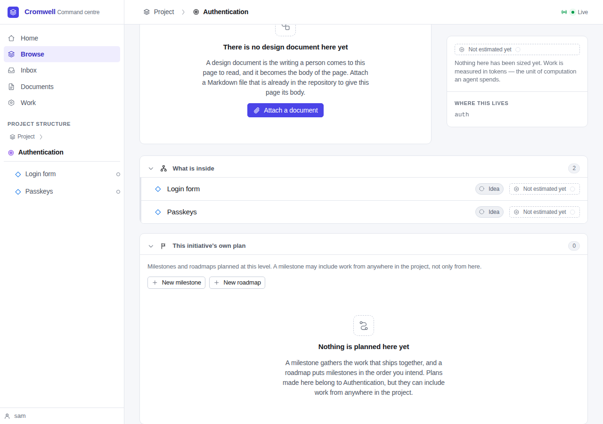

### 2. Two milestones and a roadmap, created on the initiative's page

**New milestone** asks for a name, an optional target date and an optional
description, and says where the milestone will be planned.

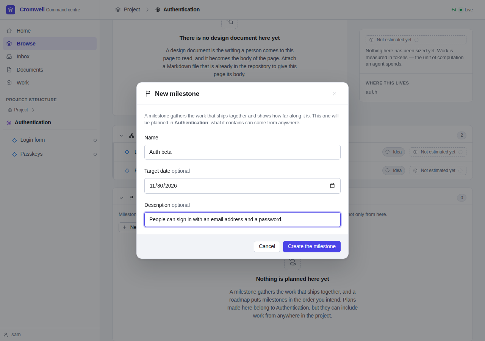

*Auth beta*, *Auth GA* and a roadmap, *Auth plan*, were created this way. All
three belong to Authentication (D-9): they appear in its plan section and not
in the project's.

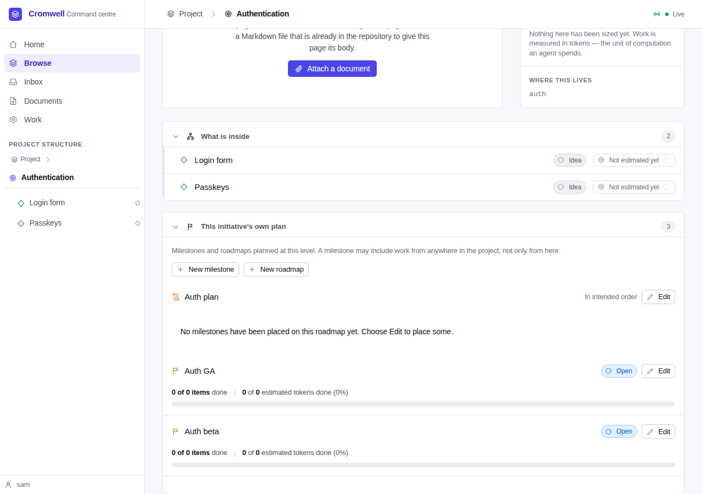

### 3. Adding from the member's end

On the Login form's own page, **Add to a milestone…** in the "more" menu lists
the open milestones it could join, grouped by where each is planned (FR-3.1).

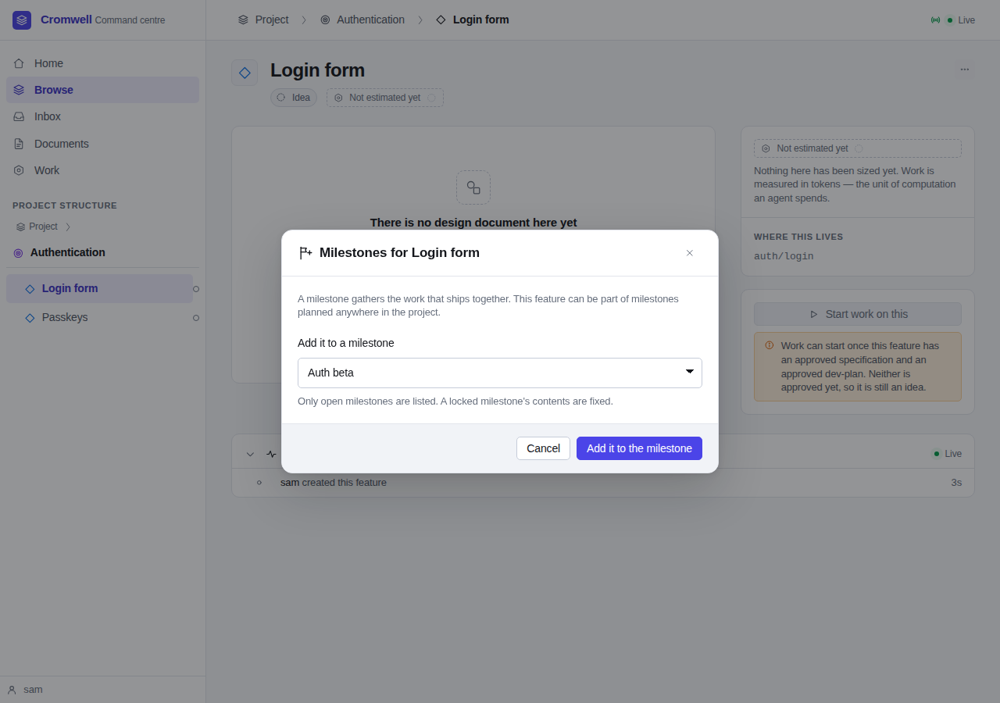

The page came back with the notice "Login form was added to Auth beta.", and
the milestone now shows in the feature's rail.

### 4. Adding from the milestone's end

**Edit** beside *Auth GA* loaded the milestone editor into a `<dialog>` (FR-6).
With the search box empty, the picker lists Authentication and everything in
it: the owner's subtree (FR-3.2). Invoices, under Billing, isn't there.

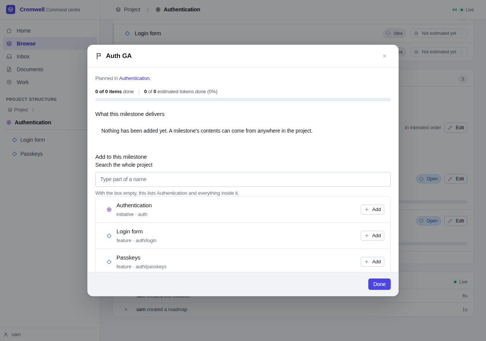

**Add** on Passkeys added it without closing the dialog. Typing "invoi" into
the search box widened the list to the whole project and found Invoices, which
lives in another tree (D-12).

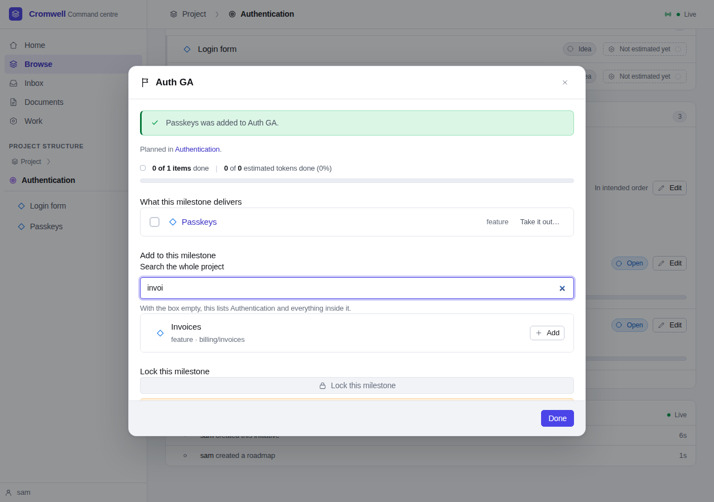

A search for "beta" found the *Auth beta* milestone, and adding it made *Auth
GA* deliver everything *Auth beta* does. The checklist now held three members.

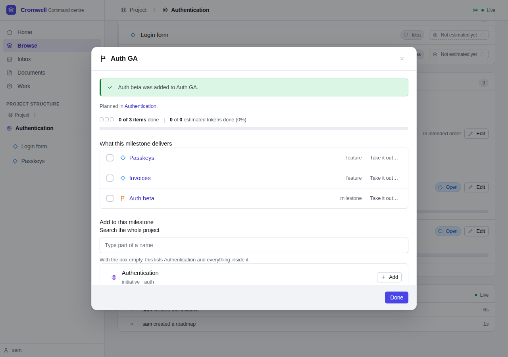

Invoices was then taken back out from the checklist, with the reason "Billing
ships in its own release." recorded on the audit trail. **Done** closed the
dialog, and because something had changed, the page underneath reloaded
(FR-6.4). The script checked that the dialog was gone afterwards.

### 5. Ordering the roadmap

**Edit** beside *Auth plan* opened the roadmap editor. *Auth GA* was placed
first, then *Auth beta* at the end.


**Up** on *Auth beta* swapped them. The roadmap is still a numbered list
(D-10).

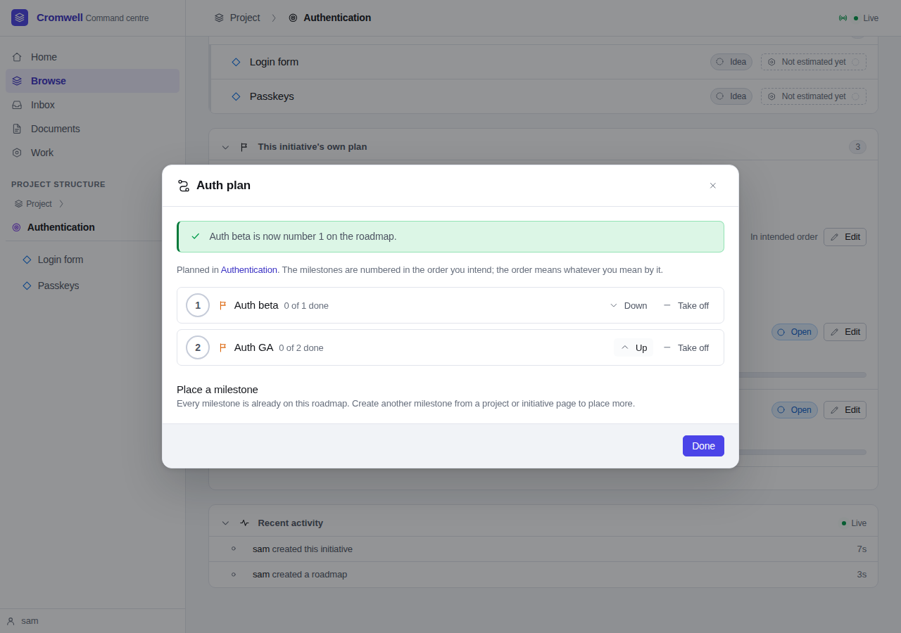

### 6. Locking: refused, then confirmed

In *Auth beta*'s editor, the lock is disabled while its one feature isn't done,
and G4's reason sits beside it in a full sentence (FR-5.1). There is no way
round it.

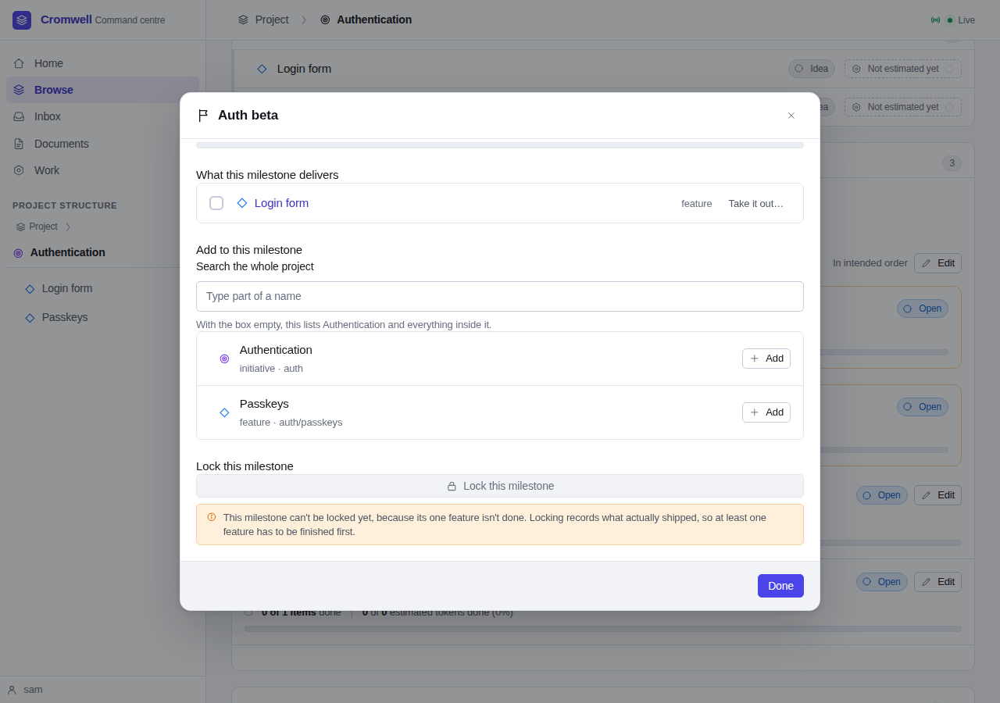

No AI provider was available to build Login form, so the script **marked it
done directly in the database**. That is the only step here not taken through
the UI. With Login form done, **Lock this milestone…** opens the confirm step
built into the page (FR-5.2).

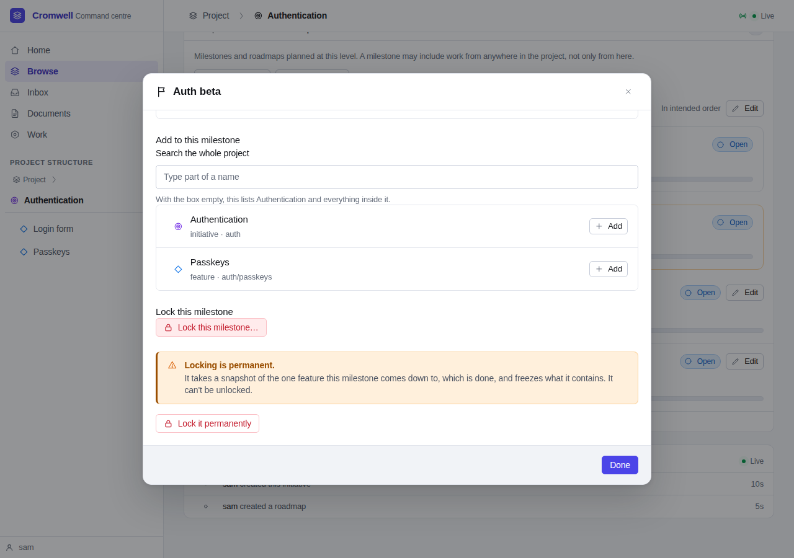

**Lock it permanently** locked it. The editor now says so, and offers nothing
to add, take out or lock (FR-3.5).

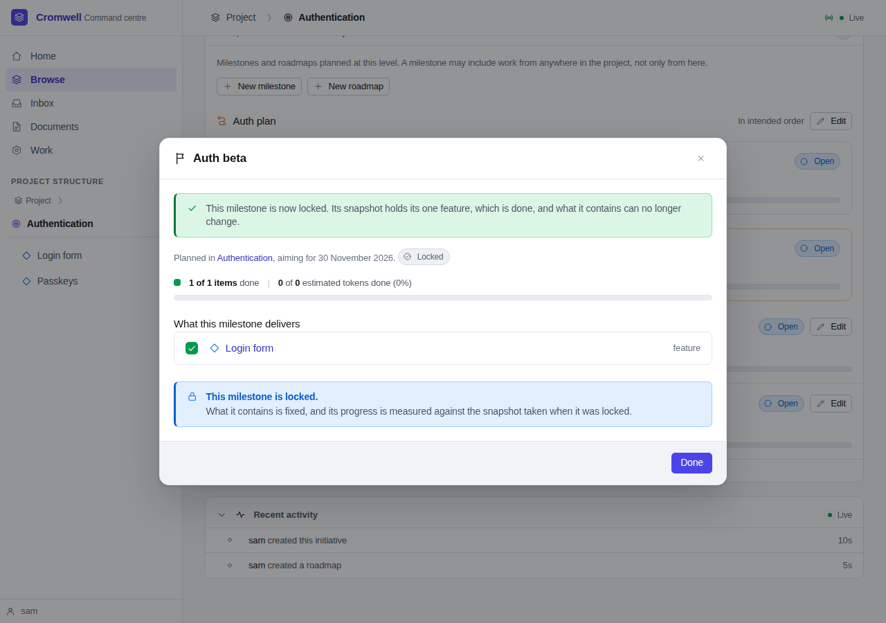

### 7. The result

Authentication's plan: the roadmap in its new order, *Auth beta* locked and
*Auth GA* open.

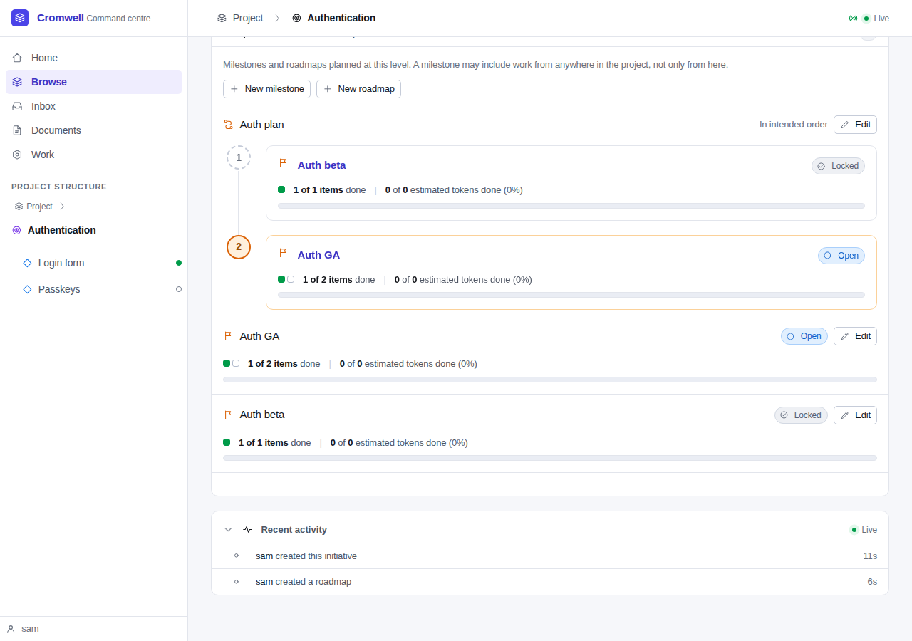

The roadmap's own page shows the same order, and now has its own **Edit this
roadmap** button (SD-6).

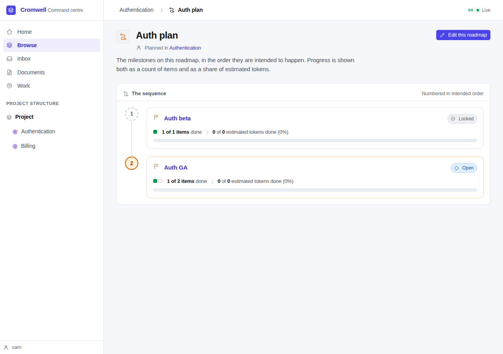

## Part 2: over MCP

The same server, the same database, and a small JSON-RPC client
([`mcp_walk.py`](walkthrough-spec-010/mcp_walk.py)) posting to `/mcp`. This time
the plan was for the Billing initiative. The output below is trimmed only of
ids.

The handshake's instructions now mention planning, and name locking among the
things a person does:

```
instructions: Cromwell's planning surface. You can create and shape initiatives,
features, titles, descriptions and document attachments, and plan with
milestones and roadmaps: create them, fill them, and order them. You cannot
start work, change a gate, lock a milestone, or run an agent — a person does
that from the command centre.

19 tools: add_milestone_member, attach_document, create_feature,
create_initiative, create_milestone, create_roadmap, get_feature,
get_initiative, get_milestone, get_roadmap, get_tree, list_documents,
list_milestones, list_roadmaps, place_roadmap_entry, remove_milestone_member,
remove_roadmap_entry, update_feature, update_initiative
```

Creating, with an owner, and one refusal:

```
→ create_feature initiative_path="billing" slug="refunds" name="Refunds" ...
   billing/refunds idea
→ create_milestone name="Billing beta" owner_path="billing" target_date="2027-01-31" ...
   owner: {'name': 'Billing', 'path': 'billing', 'type': 'initiative'}
→ create_milestone name="Billing GA" owner_path="billing"
→ create_milestone name="Oops" owner_path="payments"
  refused: there is no initiative at "payments" to plan in; call get_tree to see
  what exists, or leave owner_path out to plan at the project level
→ create_roadmap name="Billing plan" owner_path="billing"
```

Filling the milestones by name, across trees, and the loop it refuses:

```
→ add_milestone_member milestone="Billing beta" member_type="feature" member="billing/invoices"
   feature Invoices was added. → 0 of 1 items done
→ add_milestone_member milestone="Billing beta" member_type="feature" member="billing/refunds"
   feature Refunds was added. → 0 of 2 items done
→ add_milestone_member milestone="Billing GA" member_type="milestone" member="Billing beta"
   milestone Billing beta was added. → 0 of 2 items done
→ add_milestone_member milestone="Billing GA" member_type="initiative" member="auth"
   initiative Authentication was added. → 1 of 4 items done
→ add_milestone_member milestone="Billing beta" member_type="milestone" member="Billing GA"
  refused: a milestone can't contain itself, directly or through another milestone inside it
→ remove_milestone_member milestone="Billing GA" member_type="initiative" member="auth"
                          reason="Sign-in has its own release plan."
   initiative Authentication was taken out.
```

Ordering the roadmap. `place_roadmap_entry` both places and moves:

```
→ place_roadmap_entry roadmap="Billing plan" milestone="Billing GA"
   order: ['1. Billing GA']
→ place_roadmap_entry roadmap="Billing plan" milestone="Billing beta"
   order: ['1. Billing GA', '2. Billing beta']
→ place_roadmap_entry roadmap="Billing plan" milestone="Billing beta" position=1
   order: ['1. Billing beta', '2. Billing GA']
```

Reading it back. `get_milestone` tells the agent whether a person could lock it
now, and why not, in G4's own sentence:

```
→ list_milestones owner_type="initiative" owner_path="billing"
   billing's milestones: ['Billing GA', 'Billing beta']
→ list_milestones
   every milestone: [('Billing GA', 'billing', 'open'), ('Billing beta', 'billing', 'open'),
                     ('Auth GA', 'auth', 'open'), ('Auth beta', 'auth', 'locked')]
→ get_milestone milestone="Billing beta"
   members: [('feature', 'billing/invoices', False), ('feature', 'billing/refunds', False)]
   lock: {"could_lock_now": false,
          "how": "A person locks a milestone from its editor in the web UI. Locking is
                  permanent, so this facet has no tool for it.",
          "why_not": "This milestone can't be locked yet, because none of its 2 features
                      is done. Locking records what actually shipped, so at least one has
                      to be finished first."}
→ get_roadmap roadmap="Billing plan"
   roadmap: ['1. Billing beta (open)', '2. Billing GA (open)']
```

And the boundary (SD-4). There is no lock tool, and the milestone locked in the
browser can't be changed from chat:

```
→ lock_milestone milestone="Billing beta"
  protocol error -32601: there is no tool called "lock_milestone" on this server
→ add_milestone_member milestone="Auth beta" member_type="feature" member="billing/refunds"
  refused: that milestone is locked, so what it contains can't change
```

## The audit trail

Every act from both halves, by actor. The browser's acts are `sam`'s and the
chat agent's are `chat-agent`'s. The one lock is `sam`'s.

```
   actor    |           kind           | count
------------+--------------------------+-------
 chat-agent | milestone.created        |     2
 chat-agent | milestone.member_added   |     4
 chat-agent | milestone.member_removed |     1
 chat-agent | roadmap.created          |     1
 chat-agent | roadmap.entry_set        |     3
 sam        | milestone.created        |     2
 sam        | milestone.locked         |     1
 sam        | milestone.member_added   |     4
 sam        | milestone.member_removed |     1
 sam        | roadmap.created          |     1
 sam        | roadmap.entry_set        |     3
```

## The automated suite

`go vet ./...` is clean, and `go test -race -count=1 ./...` passes against
Postgres 16, including `TestUIBrowseAndDrive` and the render tests. The new
tests are:

| Test | What it covers |
|---|---|
| `TestOwnerScopedCreation` | FR-1.1: owners stored and audited; bad owners and blank names refused |
| `TestPlaceAndRemoveRoadmapEntries` | FR-1.3, FR-1.4: dense order, tied positions, take off |
| `TestMilestoneCannotContainItself` | FR-1.5: direct and nested loops refused |
| `TestMemberCandidates` | FR-3.3: subtree default, project-wide search, literal `%_`, the limit |
| `TestG4` (extended) | FR-5.1: every refusal is a sentence about features |
| `TestPlanEditorsRender` | Every new template and its shapes; no tables; no typed paths |
| `TestUIPlanEditing` | FR-2 to FR-6 through the `/ui/*` handlers, both post styles |
| `TestMCPPlanTools` | FR-7 over `POST /mcp`, the audit actor, and no lock |
| `TestMCPAdvertisedToolSetIsExactlyTheAuthoringSet` (updated) | The nineteen tools by name, and `lock_milestone` unknown |

## Small things noticed on the way

- The milestone progress line says "1 of 1 items". That wording comes from the
  existing `milestone-progress` partial, which this spec didn't change.
- With nothing estimated, the token bar reads "0 of 0 estimated tokens done
  (0%)". That is also existing behaviour.
- The project's unix socket path must be short. The first attempt to serve from
  a deeply nested scratch directory failed with `bind: invalid argument`,
  because the path to `.cromwell/run/cromwell.sock` was over the 108-byte limit.
  It has nothing to do with this spec, but it will catch anyone who serves a
  project from a long path.
