# Walkthrough: Send to development (SPEC-011)

**Date:** 2026-09-28
**Spec:** [SPEC-011](specs/SPEC-011-send-to-development.md), draft for Sam's
approval
**Status:** Definition of done item 3 run in this session. The live smoke
(item 4) needs an AI provider and Sam; its checklist is in the
[M3 handoff](notes/handoff-M3-2026-09-28.md).
**Set-up:** a fresh build of `./cmd/cromwell` and a throwaway project made with
`cromwell init` in `/var/tmp/m3demo`, served on `127.0.0.1:8811` against
Postgres 16 ([`setup.sh`](walkthrough-spec-011/setup.sh)). There was **no AI
provider**: `ANTHROPIC_API_KEY` was a dummy.
**Actors:** the web UI acted as `sam`, and the MCP facet as `chat-agent`.

The claim SPEC-011 exists to prove:

> Approving a design starts nothing. Pressing Send to development on a feature
> produces a reviewed spec, a reviewed plan, tasks and an estimate, and then
> stops at Start building.

The browser half shows everything a person sees, up to the moment an agent
would run. The dispatch half — spec, review, plan, review, estimate, stop — is
proved by the mock-provider suite (below), and live by Sam's smoke.

## Part 1: in the browser

Driven by Playwright with the pre-installed Chromium
([`walk.js`](walkthrough-spec-011/walk.js)). The script built its own tree
through the UI: an initiative, Greetings, with three features: *Tell the time*
and *Say hello*, both described, and *Something later*, with no description.

### 1. Before a design is approved, Send says why not, in G0's words

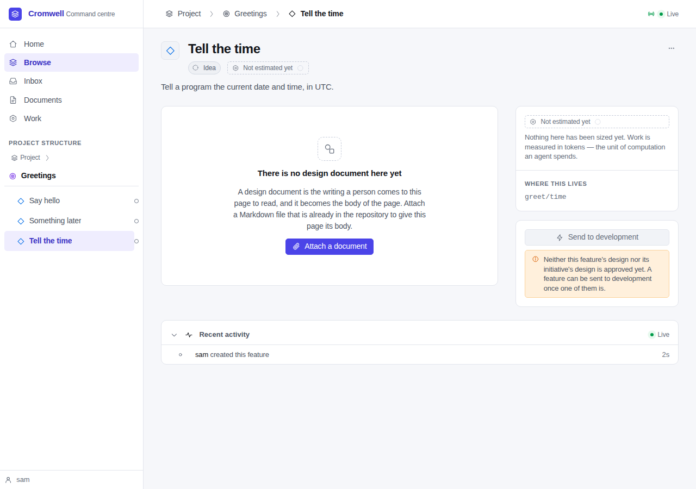

> Neither this feature's design nor its initiative's design is approved yet. A
> feature can be sent to development once one of them is.

This is G0's own reason, rewritten as a sentence so it can stand beside the
button (FR-2.6). There is no Start building card yet: the next step for an
unsent feature is sending it, not building it.

### 2. Submit, from the document page

The design was attached from the initiative's page. Its page now has
**Submit for review**, **Raise an issue** and **Detach** (FR-9). Before this
spec a draft could not be submitted from the app at all.

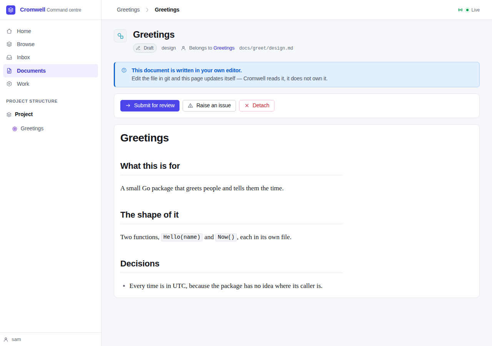

Submitted, it waits for a person. **No dispatch was queued**: the design
reviewer is retired (FR-10), so there are no agent comments.

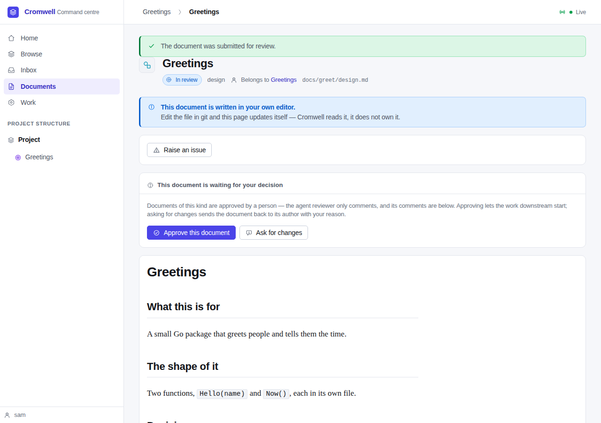

### 3. Approving the design starts nothing

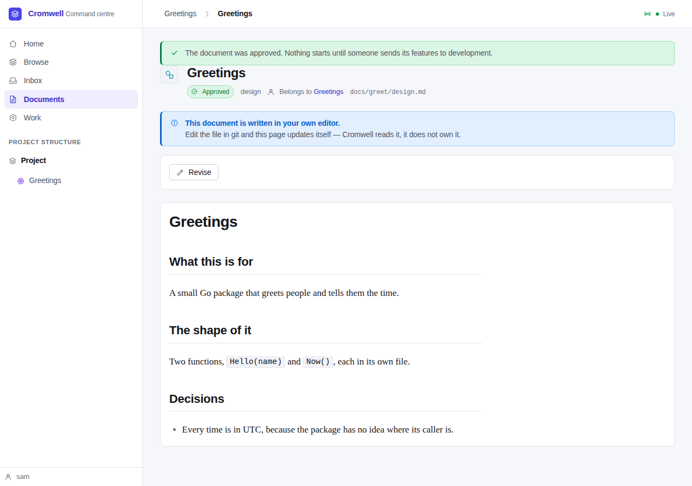

The script counted the dispatch table after the approval: **0**. The notice now
says so too: "Nothing starts until someone sends its features to development."

### 4. A feature with no description still can't be sent

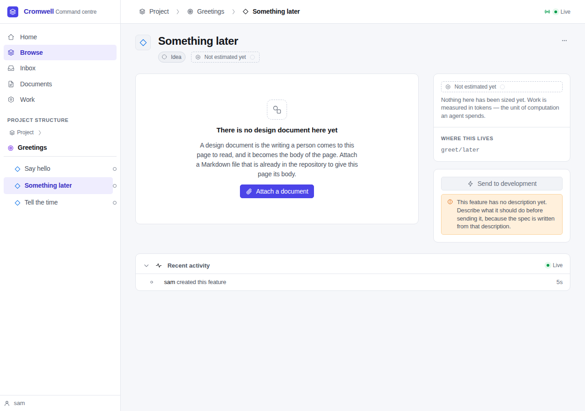

### 5. The button, and the send screen

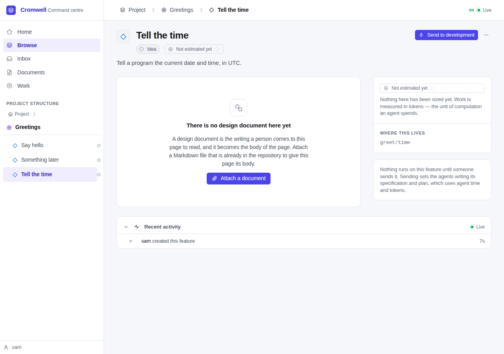

The send screen shows, before anything is committed (FR-4.3): the free agent
slots, each step with the role and model that will run it and whether it is
already done, who reviews the specification, a forecast per step ("no forecast
yet", honestly, on a project that has run nothing), and the hold, off by
default.

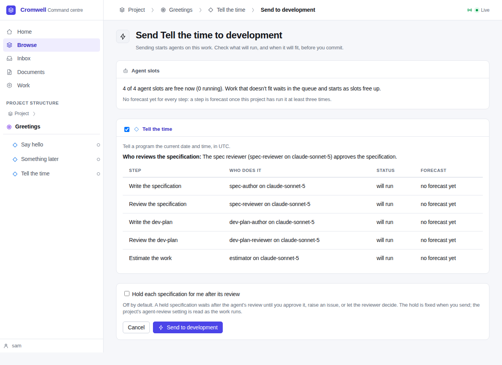

### 6. Sent, and withdrawn

To keep the spec writer in the queue without a provider, the script first
recorded a spend over the project's budget, so the governor held new work
(`queue_reason = budget`). Pressing **Send to development** wrote the mark,
queued `write-spec`, and returned to the feature, which now shows who sent it
and **Withdraw the send**.

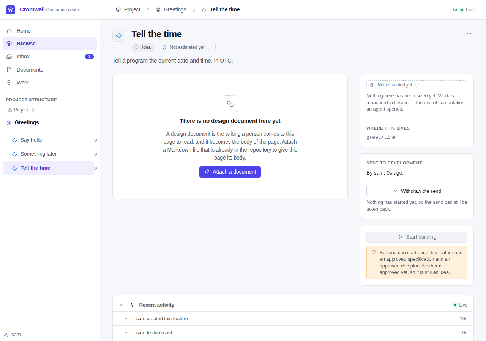

Because nothing had started, Withdraw was allowed. It removed the mark and
cancelled the queued dispatch (the script read its state: `cancelled`).

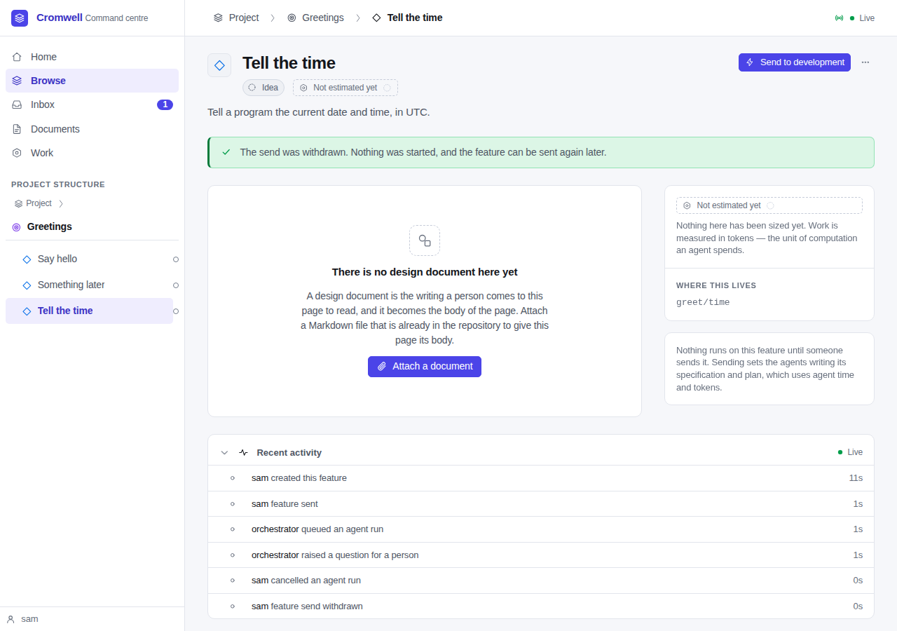

### 7. Several at once, from the initiative

**Send features to development…** on the initiative opens the same screen with
a checkbox per feature. *Something later* is listed, unticked and disabled,
with its reason.

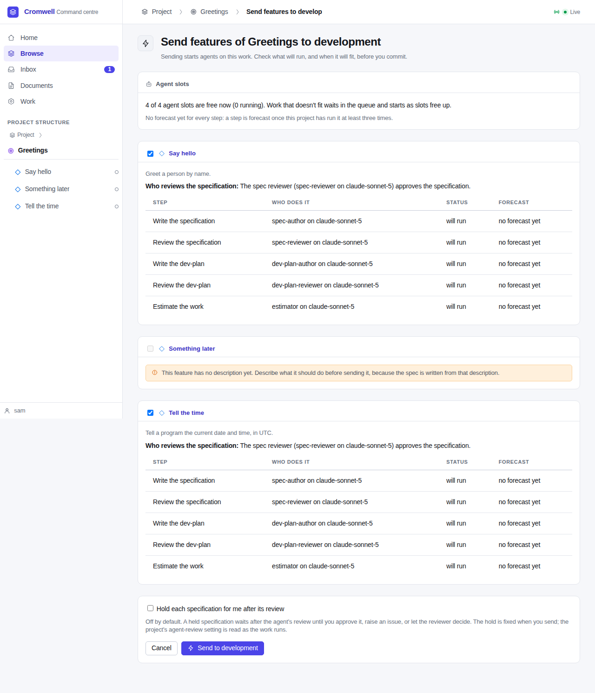

### 8. Revise and Detach

**Revise** on the approved design opens a successor draft and says where the
working copy is. The approved design stays approved and in force meanwhile.

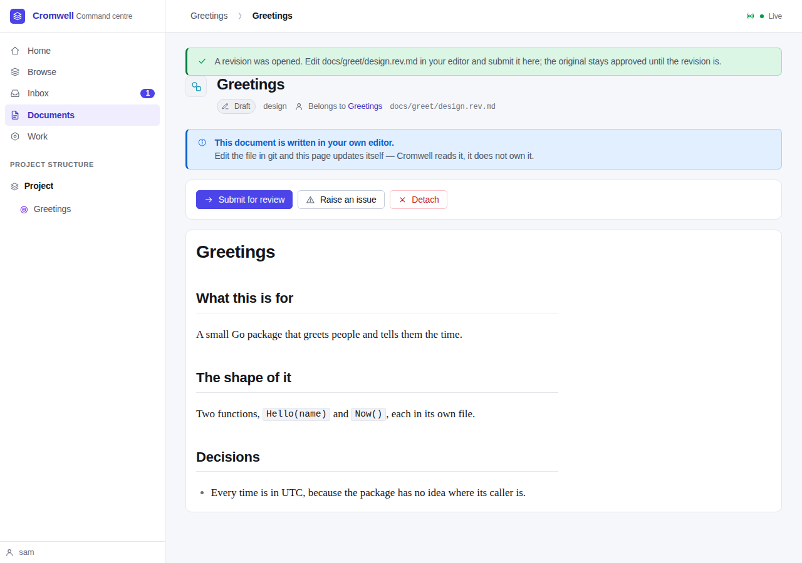

This step found a real defect: G0 read the feature's *newest* design, which
was now the revision's draft, so every feature under the initiative became
unsendable while a revision was open. G0 now asks whether an approved design
is in force (`TestAnOpenDesignRevisionKeepsG0`).

A stray note, attached by mistake, was detached behind a confirm step. The
file stays in the repository.

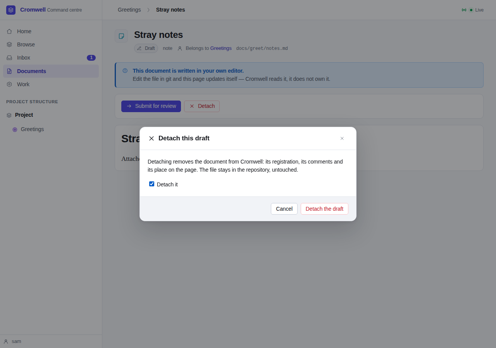
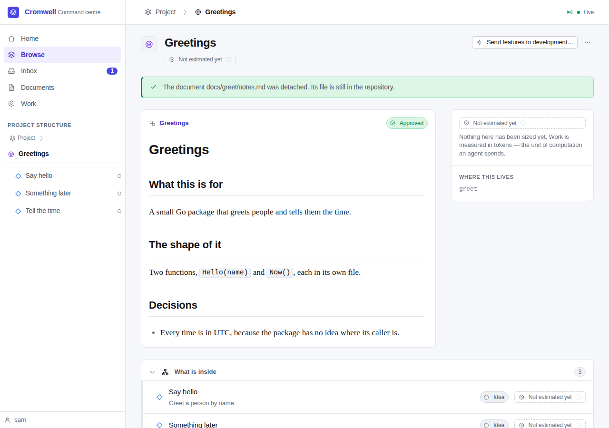

### 9. Start building

A feature reaches `ready` only when an approved spec and plan exist, which needs
an agent. Here the state was set in the database, and the walkthrough says so.
The button reads **Start building**. *Say hello* was never sent, so Send to
development is offered beside it (a `ready` feature prepared in chat can be
sent to have what is left run, which here is the estimate).

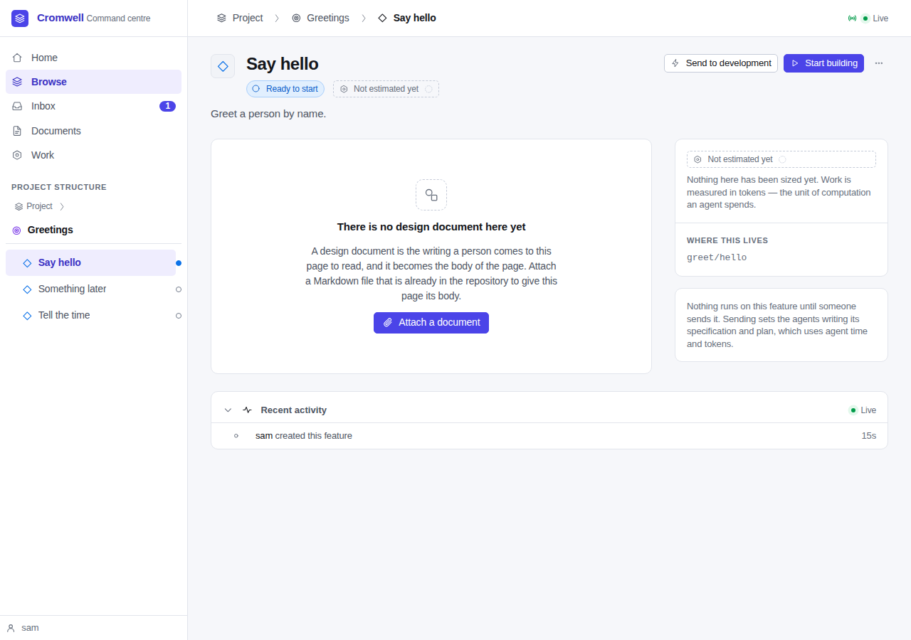

### A defect the walkthrough found in the document page

The first run of step 2 lost the page: after Submit, the navigation and the
notice vanished. The document page's forms sit inside the live-refresh block
`#doc-live`, and HTMX let them inherit its `hx-select` and `hx-swap`, so a
boosted form post replaced the whole body with the fragment. That affected the
existing Approve form too. `hx-disinherit="*"` on the block fixes it.

## Part 2: over MCP

The same server, by JSON-RPC to `POST /mcp`:

```
tools/list → add_milestone_member, attach_document, create_feature,
  create_initiative, create_milestone, create_roadmap, get_feature,
  get_initiative, get_milestone, get_roadmap, get_tree, list_documents,
  list_milestones, list_roadmaps, place_roadmap_entry, relay_issue,
  relay_release_hold, relay_review_request, relay_verdict,
  remove_milestone_member, remove_roadmap_entry, update_feature,
  update_initiative

→ relay_verdict path=docs/greet/design.rev.md verdict=approve   (no quote)
  refused: the person's words are required in quote: a relay carries what
  they said, and without it there is nothing to relay. If they haven't told
  you to do this, don't

→ relay_verdict … quote="Approve the revised greetings design."
  refused: Only a document in review can be approved; this one is draft.
  Submit it for review first.

→ relay_issue path=docs/greet/design.md …   (the approved design)
  refused: This design is approved. A design is changed by revising it, so
  start a revision and make the change there.

→ relay_issue path=docs/greet/design.rev.md issue="Say what Hello does with
  an empty name." quote="it should say what happens with no name"
  done: recorded, state draft

→ send_to_development
  error -32601: there is no tool called "send_to_development" on this server
```

The audit trail holds the relayed issue as `chat-agent`,
`document.issue_raised`, `via: mcp`, with the quote.

## Part 3: the dispatch half, with the mock provider

These run in `go test -race ./internal/server` against real Postgres:

| Test | What it shows |
|---|---|
| `TestSendRunsTheChainAndStopsAtStartBuilding` | Approving a design makes no provider call. The send screen renders; Send, with one of two features ticked, writes and reviews a spec, writes and reviews a plan, decomposes one task, records an estimate, and stops at `ready` with no implement dispatch. |
| `TestSendIsTheTrigger` | Design approval, feature creation, description and the heartbeat sweep dispatch nothing for unsent features; Send does, once, however often it replays. |
| `TestHeldSpecWaitsThenTheReviewerDecides` | A held spec waits after its agent approval; a relayed release without a quote is refused, with one is audited `via: mcp` and the approval stands as the reviewer's. |
| `TestAgentReviewOffHoldsEverySpec` | No review is queued; release is refused; a one-off review runs and is held again; a person's approval approves. |
| `TestNoSettingApprovesASpecUnreviewed` | Every combination of `agent` and `hold`: a spec is approved only by an agent review with no hold. |
| `TestIssueOnASentFeaturesSpecGoesBackToItsAuthor` | A relayed issue sends a held spec back; the author's revision prompt carries the issue and the quote; an approval that skips the issue is rejected inside the reviewer's turn; one that answers it is recorded. |
| `TestIssueOnAnApprovedSpecOpensASuccessor` | An issue on a ready feature's approved spec opens a successor; Start building refuses meanwhile; its approval supersedes the old spec and plan, returns the feature to `idea`, and a new plan is written. |
| `TestIssueOnAnUnsentFeatureIsRecordedOnly` | Recorded, nothing dispatched; and while a review escalation waits, every relay on that document is refused. |
| `TestReviseLoopIsBounded` | Three send-backs raise `authoring-deadlock`; the revision prompts carry the finding; retry in the Inbox allows one more round. |
| `TestWithdrawBeforeWorkStarts` | Withdraw cancels a queued writer; after work has run it is refused. |
| `TestDocumentPageSubmitReviseDetach` | Submit refuses an invalid draft with its reasons; Detach keeps the file and the dropped issue's words; Revise opens one successor and refuses a second. |
| `TestDesignReviewerRetiredAndChainEnabled` | The pack ships no design reviewer and has the chat-side skill; a submitted design queues nothing; a relayed design approval works and starts nothing. |
| `TestUIDesignReviewIsHumanDecided` | A project made before SPEC-011 keeps its design reviewer (SD-8). |
| `TestDesignRevisionCascade`, `TestCascadeLeavesAnUnsentFeatureWithoutASpec` | The SPEC-009 cascade over sent features, and an unsent feature's retired spec left unwritten until it is sent. |
| `TestRelayVerdictsAndRefusals`, `TestMCPAdvertisedToolSetIsExactlyTheAuthoringSet`, `TestOnlyTheWebUISends` | The relays' refusals, an escalation's send-back recorded as an issue, and the seam: no MCP tool and no API route sends. |

## What this doesn't prove

- **A real provider.** The live smoke is Sam's, with the checklist in the
  handoff.
- **Start building from a real ready feature** in the browser: that state was
  set in the database here, and the chain that reaches it is proved with the
  mock provider.
