# Walkthrough — SPEC-012, see the work

**Date:** 2026-09-28
**Spec:** [SPEC-012](specs/SPEC-012-see-the-work.md)
**Handoff:** [M6 handoff](notes/handoff-M6-2026-09-28.md)

This is the definition-of-done demo (SPEC-012 DoD 2 and 3). It ran with **no
AI provider**: every model reply came from the mock provider, scripted to look
like real work. Everything else was real: Postgres, the orchestrator, the
dispatcher, the tool host writing to a git worktree, the merge, and the web
UI in Chromium.

## How it ran

1. `CROMWELL_M6_DEMO=<dir> go test -run TestDemoM6 ./internal/server/`
   (`internal/server/demo_m6_test.go`) builds a fresh project with the real
   starter pack and drives one feature, **Login form**, from a draft spec to
   done:
   - the spec review's **first attempt fails part-way**: it calls a tool it
     isn't offered, and then the model's service refuses its next request. The
     retry sweep runs it again, and the second attempt approves with one minor
     finding;
   - the plan is reviewed and approved, and decomposed into one task;
   - the implementer lists the files, writes `greet.go`, and runs the tests;
   - the **code reviewer sends it back**: the task asks for a `Greet`
     function and the change only adds a constant;
   - the implementer fixes it, the reviewer approves with a minor note, and
     the verifier checks the one criterion with evidence. The feature merges.
2. To give review health something to flag, the harness then **seeds six
   earlier verdicts** from a careless reviewer (`code-reviewer` on
   `quick-model`: approve, "LGTM", 18 tokens out, 3 seconds). These rows are
   inserted directly; nothing ran them.
3. The harness writes the URLs and the measurements below to `demo.json`, and
   serves the UI, sending the live signal every two seconds.
4. A Playwright script, using the pre-installed Chromium, walks the pages and
   takes the screenshots.

## The feature's journey

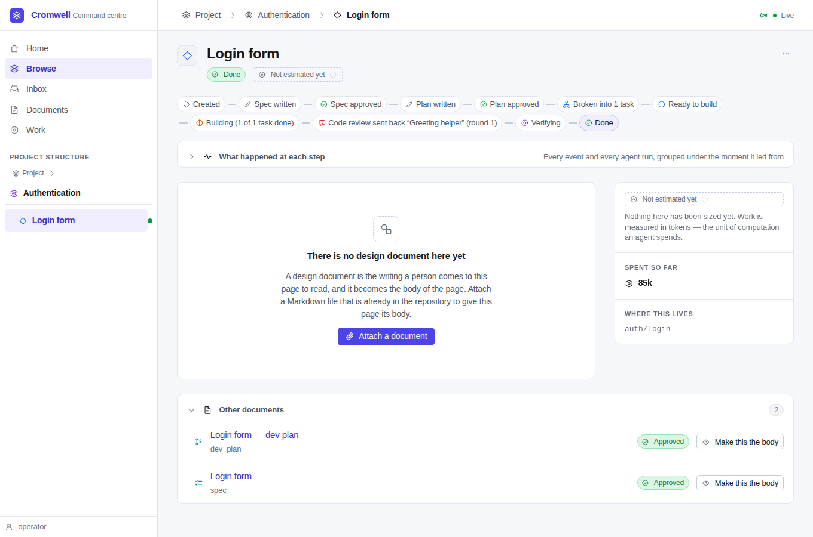

The feature page opens with its journey as one line: *Created · Spec written ·
Spec approved · Plan written · Plan approved · Broken into 1 task · Ready to
build · Building (1 of 1 task done) · Code review sent back "Greeting helper"
(round 1) · Verifying · Done*. The last mark is outlined: that's where it is
now. Each mark carries the lifecycle icon and word, not colour alone. The
design-document body follows, one line lower than before (SPEC-012 SD-14).

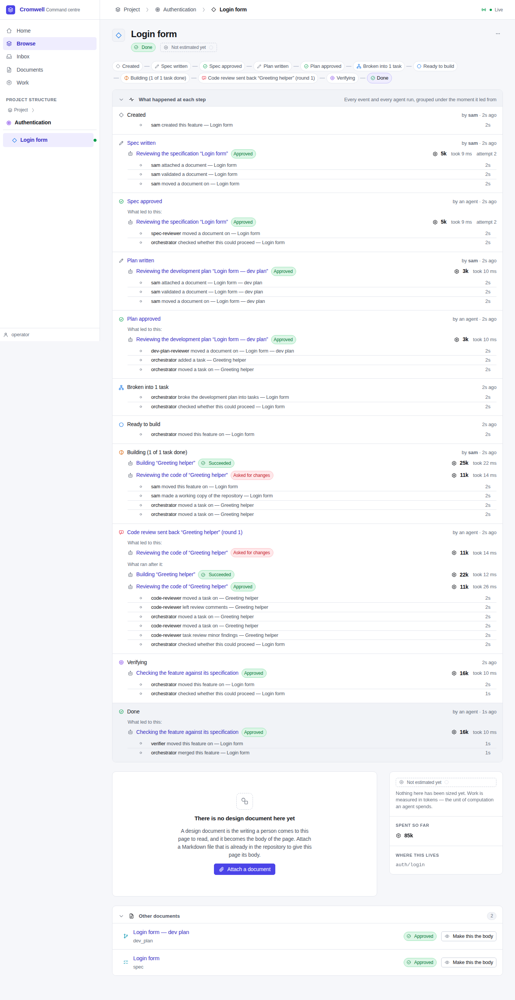

**What happened at each step** opens every moment:

- who caused it: *by sam* for the documents registered by hand, *by an agent*
  where a run did;
- **What led to this**: *Spec approved* leads to the review that approved it,
  and *Code review sent back* to the review that asked for changes;
- **What ran after it**: the sendback's phase holds the rework and its second
  review;
- the audit events of the phase, labelled for people. The runs' own
  lifecycle rows are left out, since the runs are listed.

**The live check.** With the detail open, the page received the live signal
three times in 6.5 seconds, and refreshed the line each time. The detail was
**still open** afterwards (SPEC-012 FR-6.4, R12-8).

At 420 pixels wide, the line wraps and the page doesn't scroll sideways:

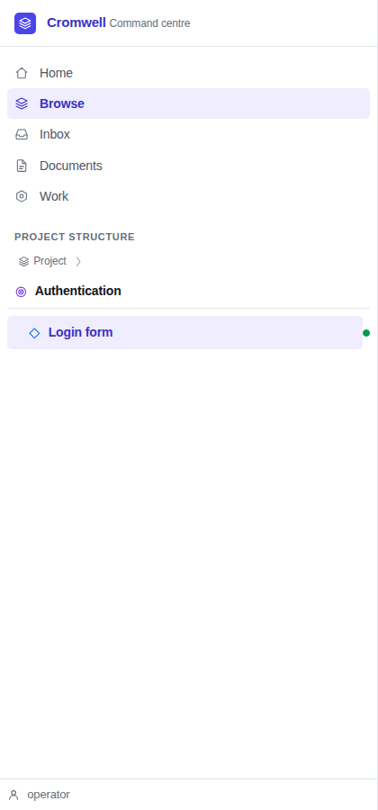

## Transcripts

The spec review, second attempt. The page says what the run was for, who ran
it, its tokens, and that it was tried twice; the conclusion comes first, then
what it was told, then what it did:

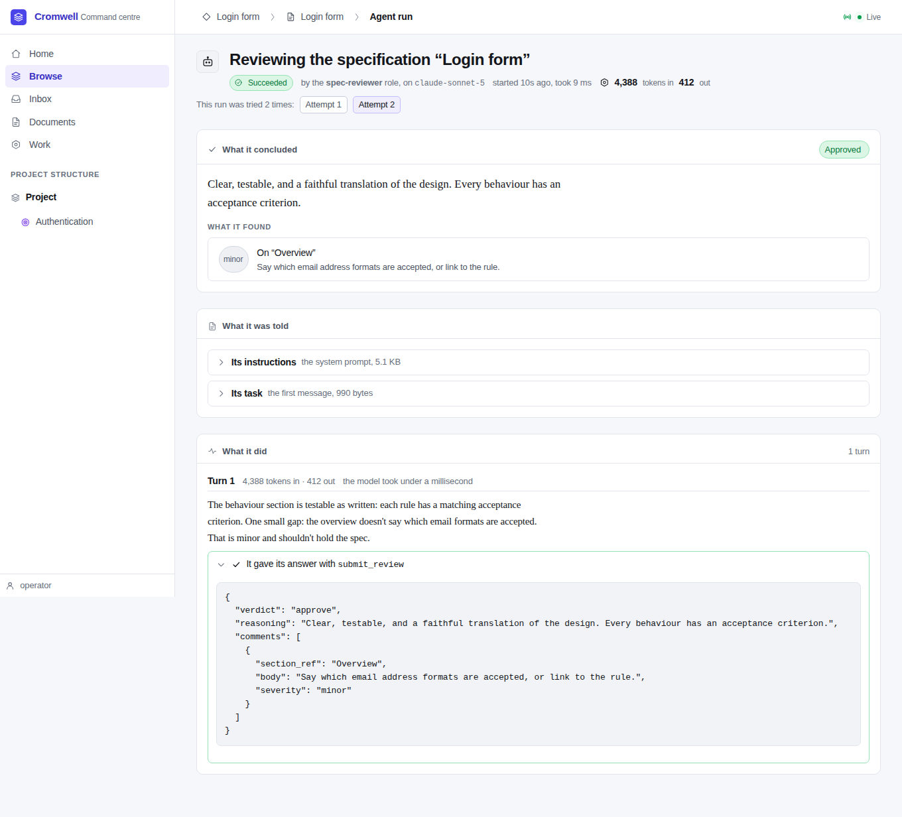

The **first attempt**, which failed. The header says *Failed*. The failure is
a sentence (*The model's service refused the request*), with the engine's text
beneath. The turn shows the agent's text, its 4,210 tokens in and 64 out, and
the tool call it wasn't allowed, opened to show what it asked for and what
came back:

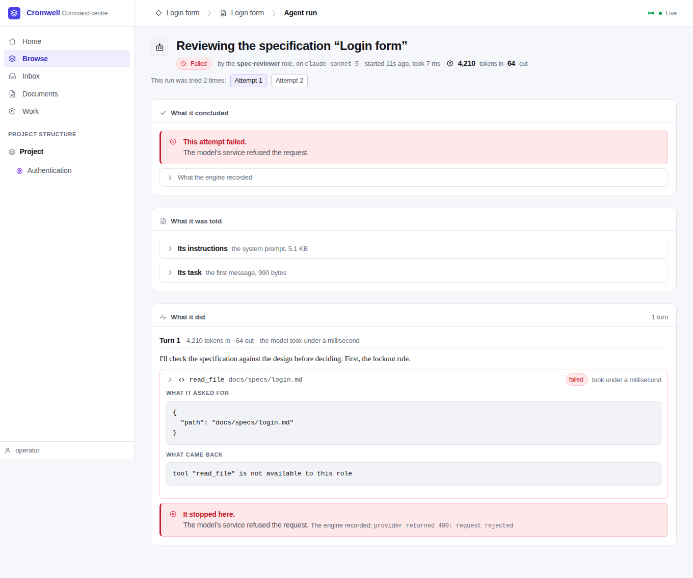

The **code review that sent the task back**, with its instructions and its
tool call opened. It read `greet.go`, saw only a constant, and asked for
changes with one major finding:

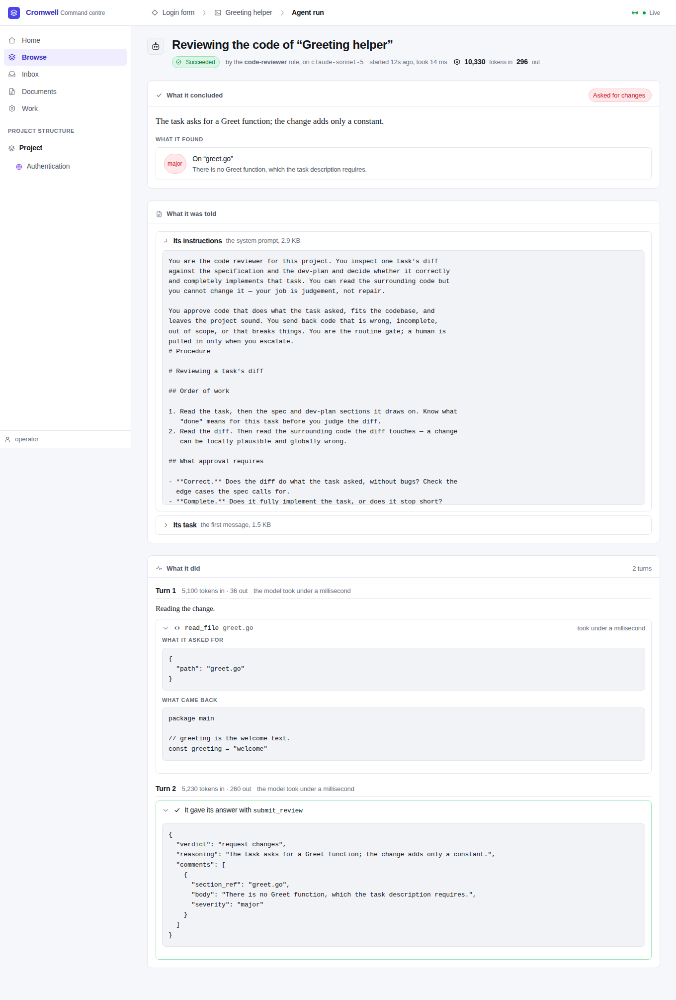

The **implementer's second run**, with every tool call opened: it rewrote
`greet.go`, ran the tests, and submitted:

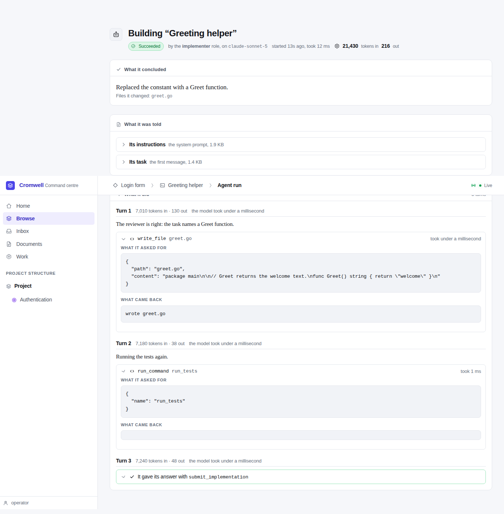

## Runs on task and document pages

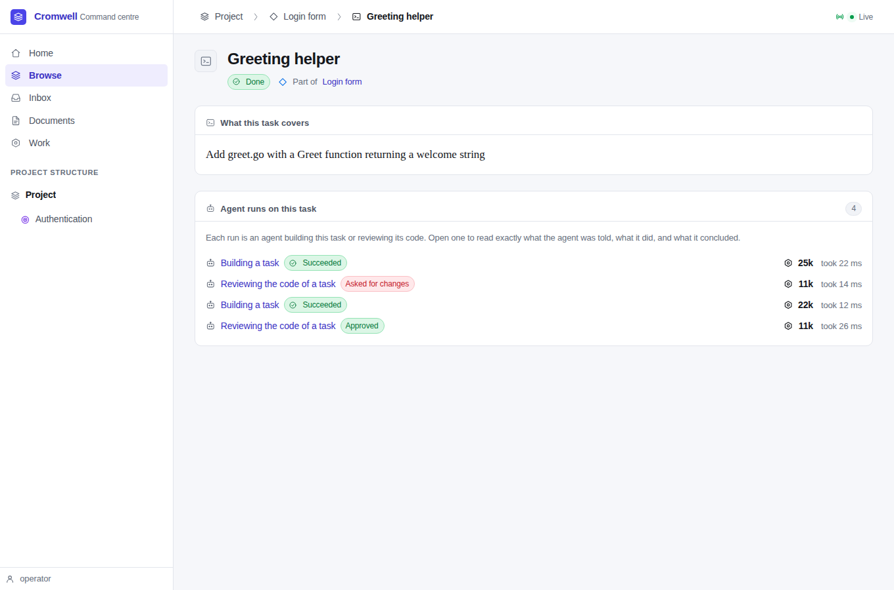

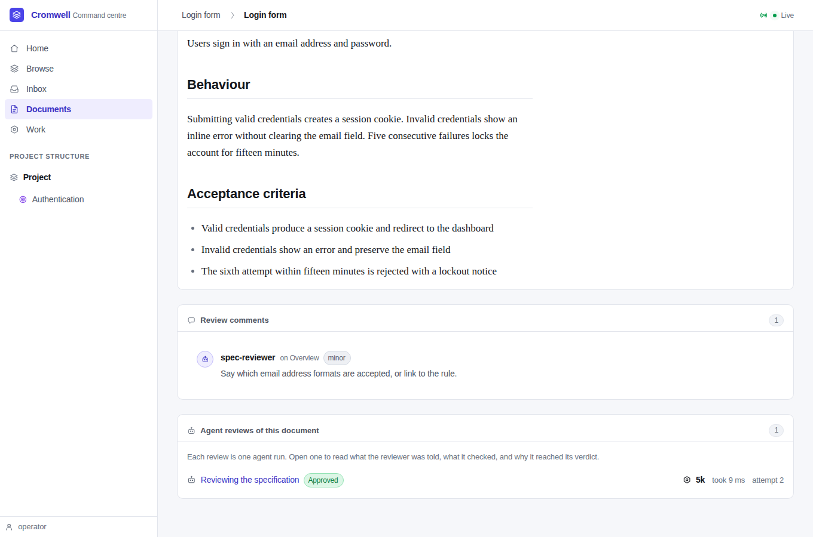

## Review health

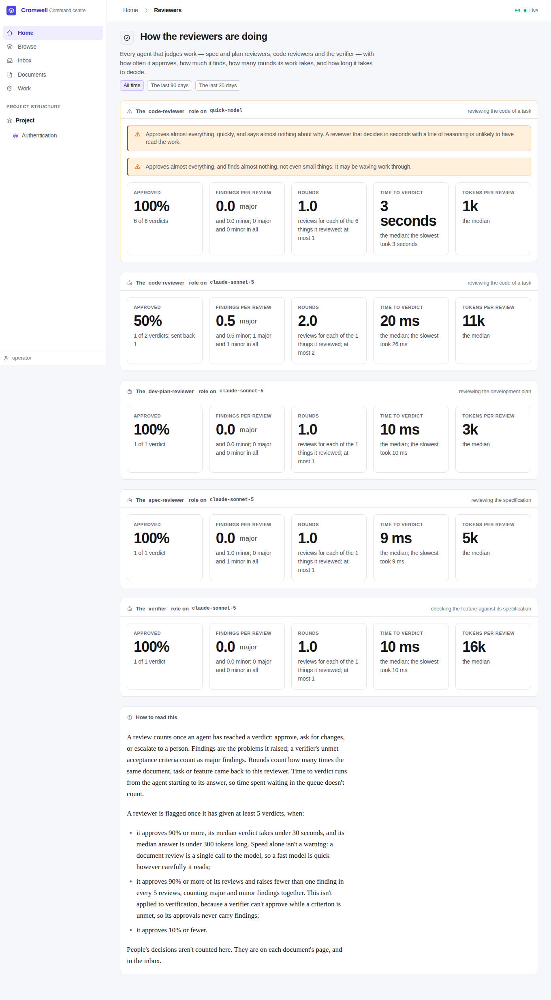

The seeded careless reviewer sorts first, flagged twice: it approves
everything, quickly, with almost nothing written, and it finds nothing. The
real reviewers from the loop have one or two verdicts each, below the five
needed before any warning. Their times are in milliseconds because the mock
replies at once; with a real model they'd be seconds. The page ends by saying
what counts and stating the warning rules.

The card on Home:

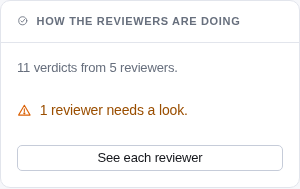

## Measurements

**Storage** (SPEC-012 NFR-2), per attempt, from the demo's own rows.
"Stored" is the text length; "on disk" is what Postgres reports after its own
compression.

| Run | Attempt | Entries | Stored | On disk |
|---|---|---|---|---|
| Spec review | 1 (failed) | 7 | 6.2 KB | 4.2 KB |
| Spec review | 2 | 6 | 6.8 KB | 4.8 KB |
| Plan review | 1 | 5 | 4.3 KB | 3.1 KB |
| Build | 1 | 17 | 4.8 KB | 4.1 KB |
| Code review (sent back) | 1 | 9 | 5.0 KB | 4.0 KB |
| Build (rework) | 1 | 13 | 3.8 KB | 3.1 KB |
| Code review | 1 | 9 | 5.0 KB | 4.0 KB |
| Verification | 1 | 9 | 4.0 KB | 3.1 KB |

Most of each is the system prompt: the starter pack's roles and skills run
3 to 5 KB. The demo's files and tool results are tiny. A real feature's
prompts carry its spec and design and its tool results carry real code, so
expect tens of kilobytes per review and a few hundred per implementation,
still far below the 4 MiB budget.

**Write time** (NFR-3): the harness wrote a typical turn 200 times against the
same Postgres (one batch of a turn, a piece of text, and a tool call, then one
batch holding the result). The average was **1.3 ms per turn**, both batches
together. A real model call takes seconds, so the overhead is well under a
tenth of a percent.

## What this didn't show

- **A real model.** Tokens, times, and text are scripted. The live smoke in
  the handoff covers this.
- **A running run's page.** The run page's status line and its polling are
  checked by `TestUIAgentRunPage`, not in the browser, because mock runs
  finish in milliseconds.
- **"Sent to development"**, which M3 adds. The timeline maps it already.
