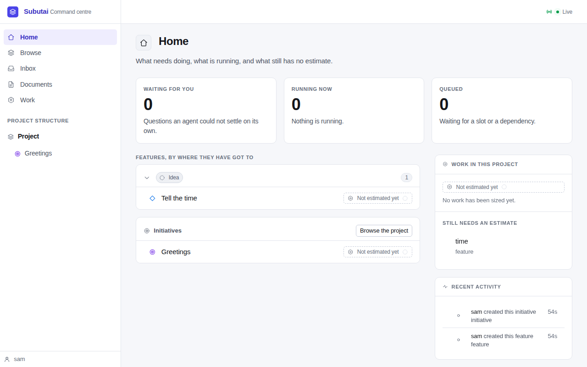
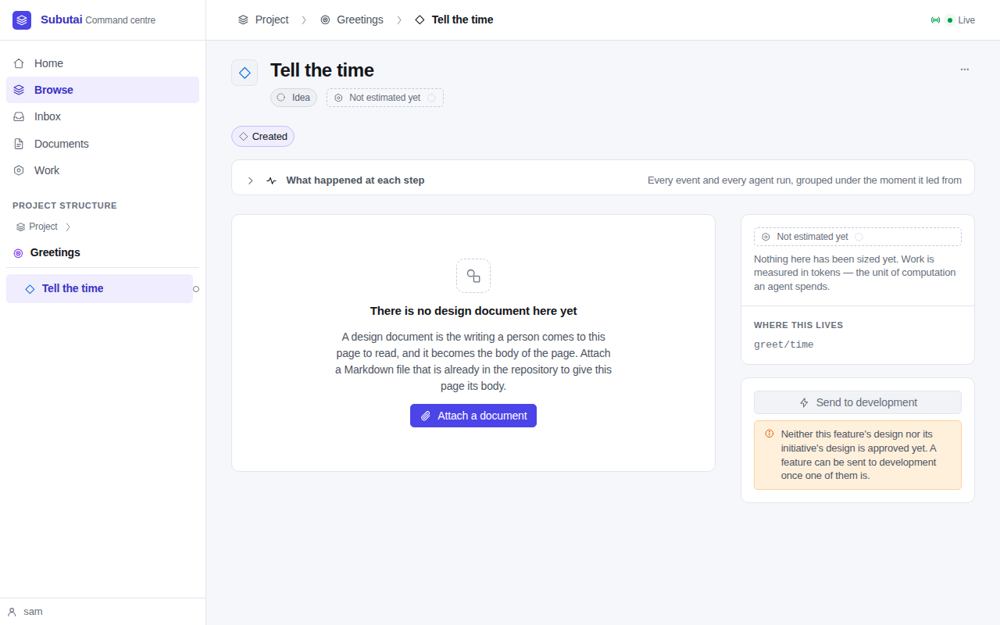
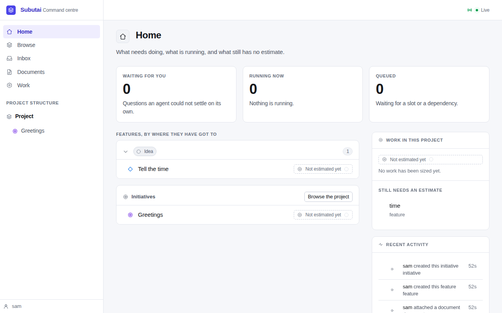
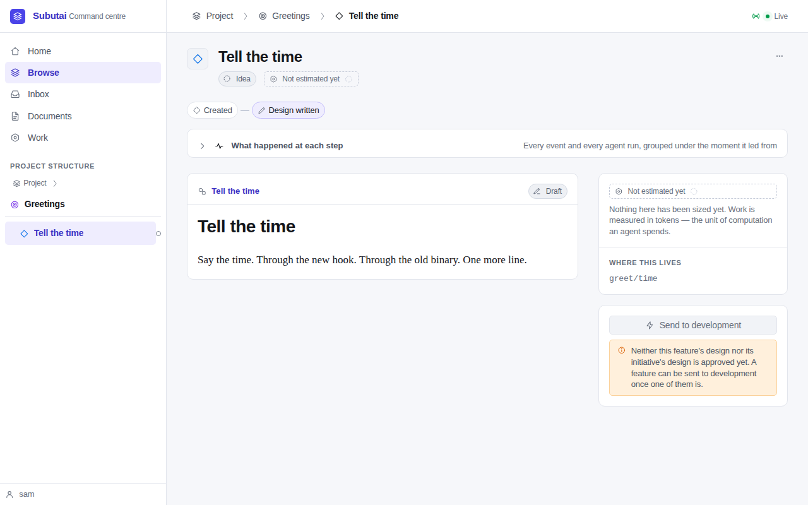

# Walkthrough — SPEC-013, rename to Subutai

**Date:** 2026-09-28
**Spec:** [SPEC-013](specs/SPEC-013-rename-to-subutai.md)
**Review:** [REVIEW-013](reviews/REVIEW-013-rename-to-subutai.md)
**Handoff:** [M7 handoff](notes/handoff-M7-2026-09-28.md)

This is the definition-of-done demo (SPEC-013 DoD 1, 4 and 5). It ran two
projects on a real Postgres with no AI provider, because nothing in the rename
needs one:

- **a fresh project**, made and served by the new `subutai` binary;
- **an old project**, made and used by the Cromwell binary built from
  `claude/lucid-cerf-ft8jbj` before the rename (commit `96d2b17`), then served
  by `subutai` with only the old variable names set, then renamed.

Both were served from short paths under `/var/tmp`, because a unix socket path
can't be longer than 108 bytes. The scripts are in
[walkthrough-spec-013/](walkthrough-spec-013/).

## The suite

- `go build ./...` and `go vet ./...` are clean.
- `go test -race -count=1 -v ./...` passed twice, with the database named
  each way:
  - with only `SUBUTAI_TEST_DATABASE_URL` set: **215 tests passed**;
  - with only `CROMWELL_TEST_DATABASE_URL` set: **215 passed**, and the test
    helper printed the fallback warning.
- In both runs the only skip was `TestDemoM6`, the M6 demo harness, which runs
  only when `SUBUTAI_M6_DEMO` names a directory. No integration test skipped.

One test, `TestAgentReviewOffHoldsEverySpec`, failed once during the work. It
fails the same way before the rename, 3 times in 12 under `-race`: it asked
for a spec's hold before the orchestrator had written it. It now waits for the
hold, and passed 15 times in 15 (commit `2131d34`).

## A fresh project

```sh
go build -o /var/tmp/m7/subutai ./cmd/subutai
cd /var/tmp/m7demo            # a new git repository
export SUBUTAI_DATABASE_URL=postgres://postgres@localhost:54329/m7_fresh?sslmode=disable
/var/tmp/m7/subutai init
```

`init` printed `initialised .subutai/ — set ANTHROPIC_API_KEY, then run
\`subutai serve\``. It made `.subutai/` with the chat skills, config, pack lock,
roles, skills and templates, wrote `url_env: SUBUTAI_DATABASE_URL` into
`config.yaml`, and installed this hook:

```sh
#!/bin/sh
# Installed by subutai init: notify the server of document changes
# (FR-4.2). Silent no-op when the server is not running.
exec "/var/tmp/m7/subutai" hook post-commit --repo "/var/tmp/m7demo" >/dev/null 2>&1 || true
```

`subutai serve` started with no warnings:

```
level=INFO msg="subutai server listening" net=unix addr=/var/tmp/m7demo/.subutai/run/subutai.sock
level=INFO msg="subutai server listening" net=tcp addr=127.0.0.1:8870
```

Then, from the CLI, an initiative **Greetings** and a feature **Tell the
time**, and a design registered to it. Each later commit to the design went
through the hook and was re-indexed: `subutai log` gained a
`document.indexed` row, and the recorded hash matched the file.

The MCP server now introduces itself as Subutai:

```
{"serverInfo":{"name":"subutai","version":"1"},
 "instructions":"Subutai's planning surface. …"}
```

Playwright, with the pre-installed Chromium, read the page titles as
**"Home — Subutai"** and **"Tell the time — Subutai"**, and the brand as
**Subutai**:





## An old project

### Made with Cromwell

[`old-1.sh`](walkthrough-spec-013/old-1.sh) used the Cromwell binary for
everything, with `CROMWELL_DATABASE_URL`: `cromwell init`, then `cromwell
serve`, an initiative, a feature, and a design registered. Cromwell's hook:

```sh
#!/bin/sh
# Installed by cromwell init: notify the server of document changes
# (FR-4.2). Silent no-op when the server is not running.
exec "/var/tmp/m7/cromwell" hook post-commit --repo "/var/tmp/m7old" >/dev/null 2>&1 || true
```

Its socket was `.cromwell/run/cromwell.sock`. The Cromwell server was then
stopped.

### Served by Subutai, old names only

[`serve-old-subutai.sh`](walkthrough-spec-013/serve-old-subutai.sh) served the
same project with `subutai serve`, with `CROMWELL_DATABASE_URL` set and no
`SUBUTAI_*` variable at all. It loaded, and said what to change, one line each:

```
updated .git/hooks/post-commit to run /var/tmp/m7/subutai
warning: this project's folder is .cromwell/, Subutai's old name. Stop the server and run `git mv .cromwell .subutai`. .cromwell/ is read until the next release.
warning: config.yaml's database.url_env names CROMWELL_DATABASE_URL, Subutai's old name; change it to SUBUTAI_DATABASE_URL.
warning: CROMWELL_DATABASE_URL is Subutai's old name for SUBUTAI_DATABASE_URL; rename it. The old name is read until the next release.
level=INFO msg="subutai server listening" net=unix addr=/var/tmp/m7old/.cromwell/run/cromwell.sock
level=INFO msg="subutai server listening" net=tcp addr=127.0.0.1:8871
```

The socket kept its old name under the old folder (SPEC-013 §3.2), and the hook
now runs the new binary:

```sh
#!/bin/sh
# Installed by subutai init: notify the server of document changes
# (FR-4.2). Silent no-op when the server is not running.
exec "/var/tmp/m7/subutai" hook post-commit --repo "/var/tmp/m7old" >/dev/null 2>&1 || true
```

[`old-2.sh`](walkthrough-spec-013/old-2.sh) then checked each way in:

| What | Result |
|---|---|
| `subutai status` in the old project | Worked, after the one-line folder warning |
| A commit, through the refreshed hook | `document.indexed` rows went from 2 to 3 |
| A commit with hooks off, then the **Cromwell binary's** `hook post-commit` by hand | Re-indexed: the old binary reached the new server over the kept socket name, and its `X-Cromwell-Actor` header was accepted |
| The document's recorded hash against the file | Equal |
| `cromwell status`, the old binary, against the new server | Worked |
| Audit rows written by Cromwell | Unchanged: `initiative.created`, `feature.created`, `document.registered`, each by `sam` |

The web UI showed the Cromwell-made data under the new name:





### Renamed

With the server stopped:

```sh
git mv .cromwell .subutai
git commit -qm "Rename .cromwell to .subutai"
```

`git mv` moved the whole folder, `run/` included. With `SUBUTAI_DATABASE_URL`
set and `CROMWELL_DATABASE_URL` unset ([`old-4.sh`](walkthrough-spec-013/old-4.sh)):

- **`config.yaml` still naming the old variable:** the server started with one
  warning, about `url_env`, on the new socket `.subutai/run/subutai.sock`.
- **`url_env` changed to `SUBUTAI_DATABASE_URL`:** the server started with no
  warnings at all.
- **A commit after the rename** went through the hook: `document.indexed`
  rows went from 3 to 4.
- **With an empty `.cromwell/` made again beside `.subutai/`,** `subutai
  status` warned once: "both .subutai/ and .cromwell/ exist; using .subutai/."

The rename with a feature building isn't shown here, because starting one
needs an approved spec and plan. `TestWorktreeFoundAfterFolderRename` covers
it: a worktree made and registered with git under `.cromwell/` is moved with
the folder, found under `.subutai/`, repaired with `git worktree repair`, and
works; nothing re-creates `.cromwell/`.

## The scripts

- **`scripts/test-db.sh`** now prints one line exporting both names:

  ```
  export SUBUTAI_TEST_DATABASE_URL="postgres://postgres@localhost:54329/postgres?sslmode=disable" CROMWELL_TEST_DATABASE_URL="postgres://postgres@localhost:54329/postgres?sslmode=disable"
  ```

  With `CROMWELL_TEST_PGPORT=54329` and no `SUBUTAI_TEST_PGPORT`, it printed
  the fallback warning and used the port.
- **`scripts/smoke-project.sh`**, with only `CROMWELL_TEST_DATABASE_URL` set,
  warned once, built `/tmp/subutai`, and made `/tmp/subutai-smoke` with the
  database `subutai_smoke`, `url_env: SUBUTAI_DATABASE_URL`, and a hook running
  `/tmp/subutai`. It makes no AI calls.

## What this demo doesn't show

- **A live run with a real provider.** Nothing in the rename touches the
  prompts or the provider; the suite's mock-provider tests cover the loop.
- **An existing chat client.** The MCP endpoint is unchanged (`/mcp`), and
  only the server's advertised name changed, so a client added as `cromwell`
  keeps working. That is by inspection, not a run with a real client.
