# Walkthrough: checklists and jobs (SPEC-014)

**Date:** 2026-09-28
**Spec:** [SPEC-014](specs/SPEC-014-checklists-and-jobs.md), draft for Sam's
approval, reviewed in [REVIEW-014](reviews/REVIEW-014-checklists-and-jobs.md)
**Status:** Definition of done items 2 to 5 run in this session, against the
build that is on the branch.
**Set-up:** a fresh build of `./cmd/subutai`, a throwaway project made with
`subutai init` in `/var/tmp/m5demo`, served on `127.0.0.1:8815` against
Postgres 16. There was **no AI provider**: `ANTHROPIC_API_KEY` was a dummy, and
nothing in this walkthrough dispatches an agent.
**Actors:** the web UI acted as `sam` (`server.ui_actor`), and the MCP facet as
`chat-agent` (`server.mcp_actor`).
**Scripts:** [`walk.js`](walkthrough-spec-014/walk.js) (Playwright with the
pre-installed Chromium, in two parts) and
[`mcp_walk.py`](walkthrough-spec-014/mcp_walk.py) (plain JSON-RPC to `POST
/mcp`), with their output in [`walk-a.log`](walkthrough-spec-014/walk-a.log),
[`mcp_walk.log`](walkthrough-spec-014/mcp_walk.log) and
[`walk-b.log`](walkthrough-spec-014/walk-b.log).

The claims SPEC-014 exists to prove:

> A milestone that contains a checklist doesn't show as complete while one of
> its jobs is unticked, and does once every job is ticked — whether the ticks
> come from the checklist page or are relayed from chat with the person's
> words.

> Marking such a milestone as shipped while a job is unticked records the
> checklist as not shipped, just as it does a feature that isn't done.

Both held.

## Part 1: in the browser

The script first made the tree it plans over, through the UI: an initiative,
Authentication, with one feature, Login form.

### 1. New checklist, from the initiative's plan

The plan section now has **New checklist** beside **New milestone** and **New
roadmap** (FR-3.2). The dialog says what a checklist is for and where it will
be planned.

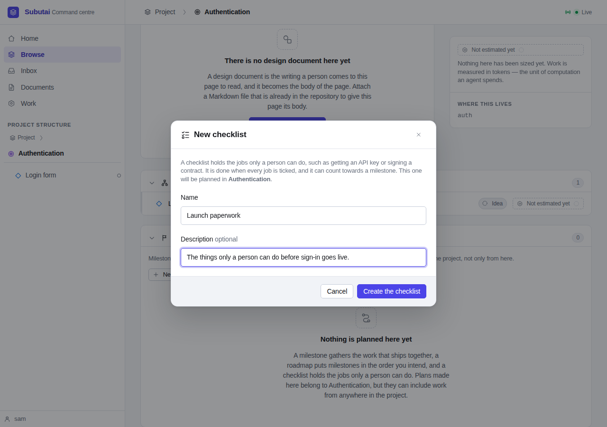

*Launch paperwork* is planned in Authentication and appears in its plan
section with its status, "No jobs yet", and an **Edit** button (FR-3.1).

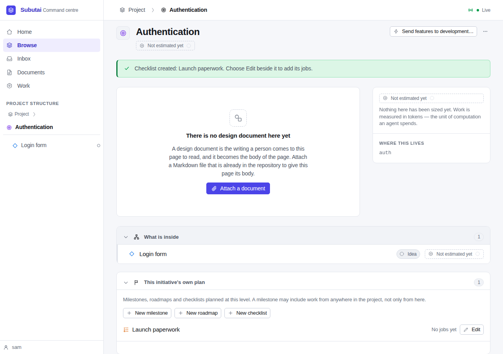

### 2. Adding jobs in the checklist editor

**Edit** loaded the checklist editor into a `<dialog>`, as the milestone
editor is loaded (FR-5). Three jobs were added, one with a note, and the icon
job was moved up to second. Each change came back in the dialog with a
notice, and the first job has no **Up** and the last no **Down**.

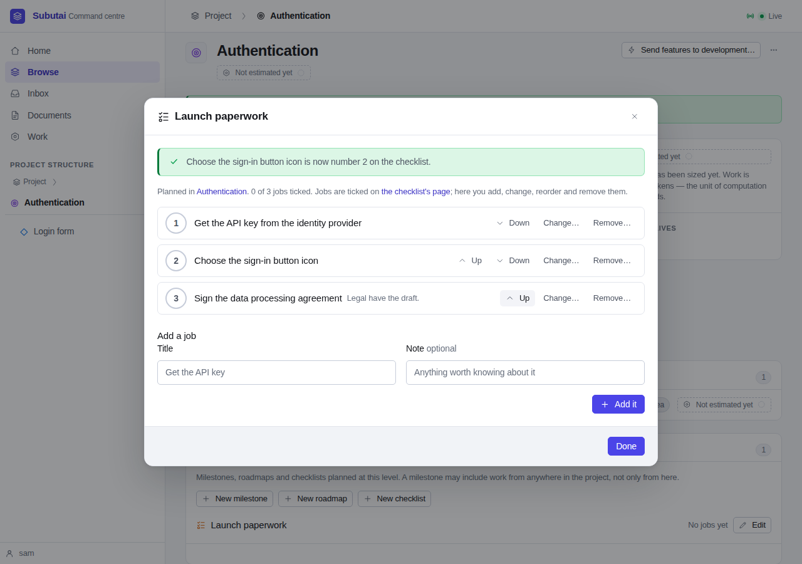

Ticking isn't here: it happens on the checklist's own page (SD-5).

### 3. The checklist in a milestone

A milestone, *Sign-in beta*, was created in the same plan. Its editor's picker
offered the checklist, with its icon, beside Login form (FR-6.1). Both were
added. The checklist's row says "0 of 3 jobs ticked · checklist" (FR-2.6).

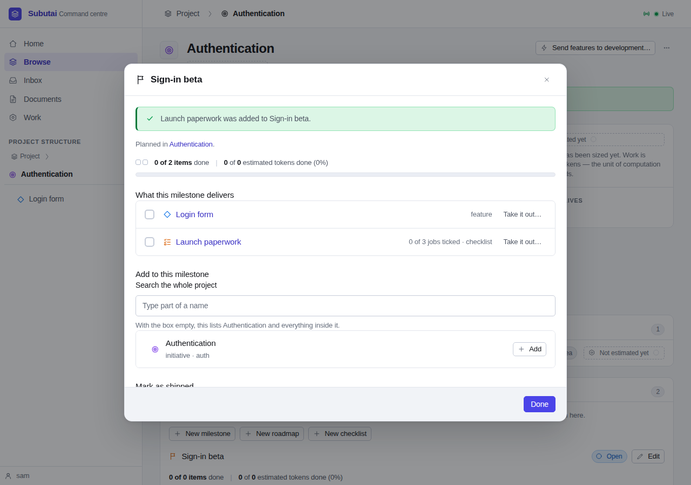

Login form was then finished. With no AI provider, nothing can finish it for
real, so the script set it to `done` in the database, as the M4 walkthrough
did.

### 4. The milestone isn't complete

With the feature done and no job ticked, the milestone reads **1 of 2 items
done**. The token bar is unchanged by the checklist, which carries no tokens
(FR-2.3).

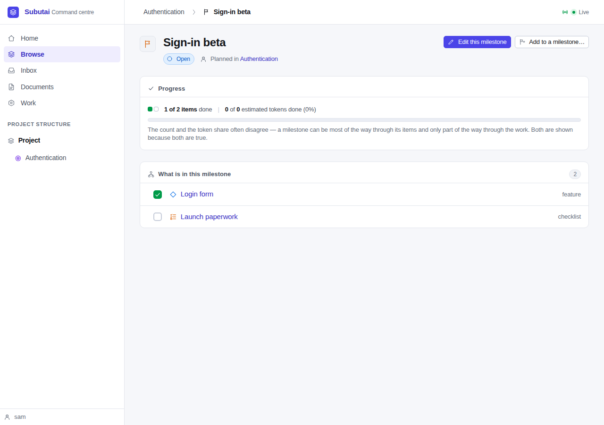

### 5. Ticking jobs on the checklist page

The checklist's page, `/ui/c/{id}`, is its jobs as plain checkboxes (FR-4,
D-10). Its head says where it is planned, how many jobs are ticked, and which
milestone it is part of.

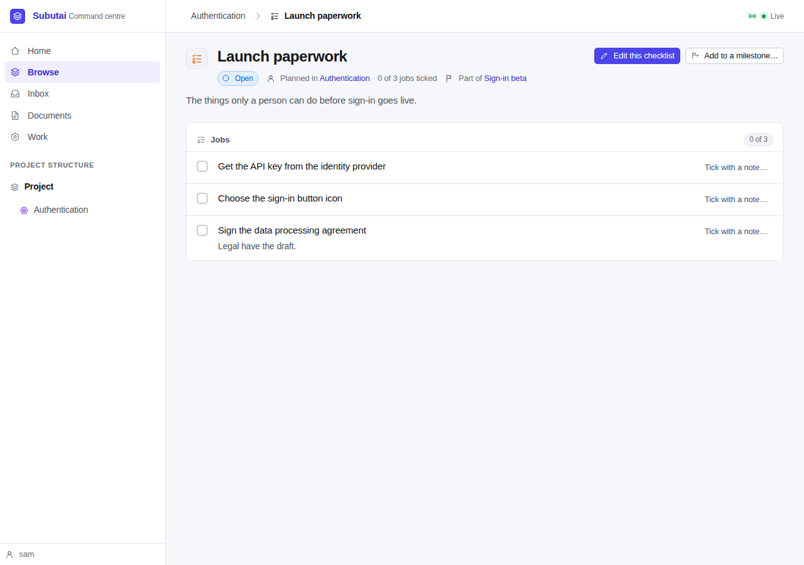

The first job was ticked **with a note**, through its disclosure (FR-4.3).

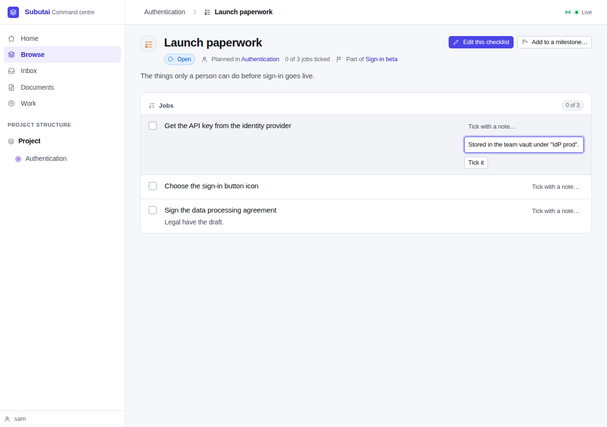

The icon job was ticked by pressing its box. Each ticked job shows who ticked
it and when, and the note replaced the job's note (SD-6, SD-8). With one job
open, the milestone still read 1 of 2 items done.

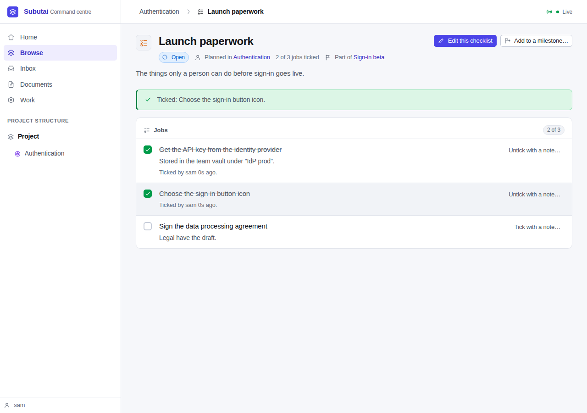

### 6. The last job: complete

Ticking the data processing agreement made the checklist done ("Done: every
job is ticked")…

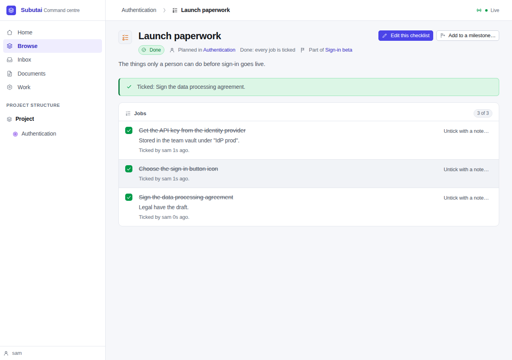

…and the milestone complete: **2 of 2 items done**.

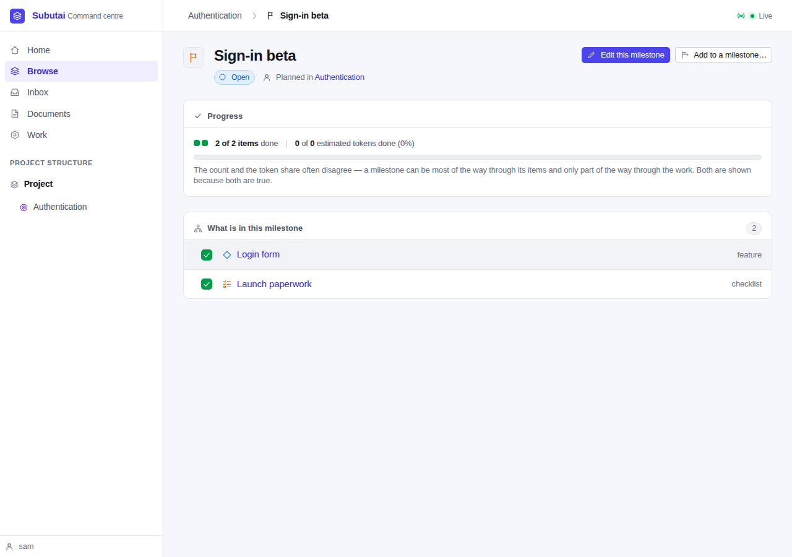

The script's log reads:

```
milestone before ticking: 1 of 2 items done | 0 of 0 estimated tokens done (0%)
milestone with one job open: 1 of 2 items done | 0 of 0 estimated tokens done (0%)
milestone after ticking: 2 of 2 items done | 0 of 0 estimated tokens done (0%)
```

## Part 2: over MCP

[`mcp_walk.py`](walkthrough-spec-014/mcp_walk.py) ran against the same
server; its whole output is in [`mcp_walk.log`](walkthrough-spec-014/mcp_walk.log).

- The facet now advertises **33 tools**: SPEC-010's twenty-five and SPEC-014's
  eight (FR-7.10). The `initialize` instructions mention checklists, and that
  a job's tick is relayed with the person's words.
- **Planning, without quoted words.** `create_checklist` made *Store listing*
  in Authentication with two jobs, and `add_job` put a third at position 2.
  `create_milestone` and `add_milestone_member` made *Sign-in GA* with Login
  form and the checklist: "Items: 1 of 2 done".
- **The relay.** `relay_tick_job` without a quote was refused, in the same
  sentence the other relays use, and wrote nothing. With the person's words it
  ticked *Write the store description*. *Choose the age rating* was ticked
  ("We went with 4+"), unticked ("Hold on, legal want 12+ because of the chat
  feature") and ticked again with a note ("Age rating is done, it's 12+"): an
  untick is relayed the same way (SD-10).
- **Planning can't stand in for a tick** (SD-7). `rename_job` on the ticked
  age-rating job was refused: "that job is ticked, so its title can't change:
  the tick is for the job as it was." `remove_job` on the last unticked job
  was refused: "removing that job would leave the checklist done without
  anyone ticking it, so you can't do it from here."
- `get_milestone` read *Sign-in GA* back as 1 of 2 items done, with the
  checklist listed by id and not done. G4 would let it be marked as shipped,
  because Login form is done.

## Part 3: the relayed words, and shipping with a job open

Back in the browser ([`walk.js`](walkthrough-spec-014/walk.js) part b).

### 7. The relayed words on the page

The checklist page shows each relayed tick as the chat agent's, with the
person's words beside it (SD-8), and the note given with the tick.

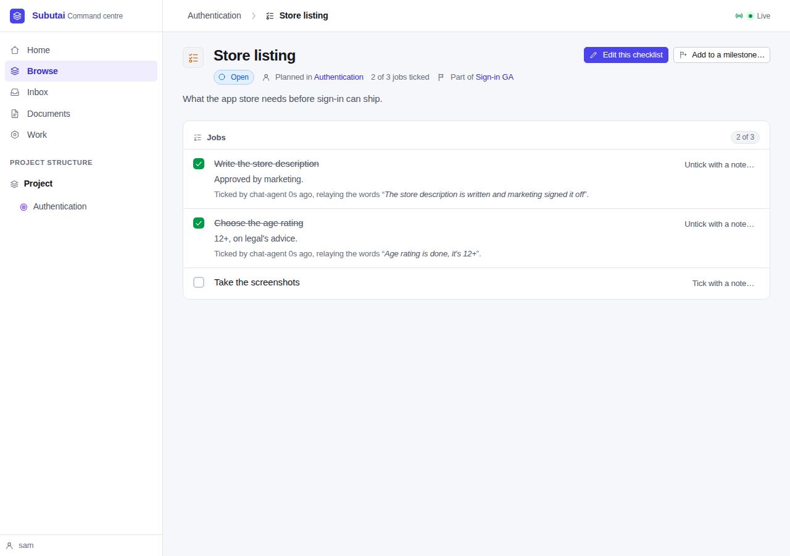

### 8. Marking the milestone as shipped with a job still open

*Sign-in GA*'s editor says what marking it as shipped does, now counting
items, and that anything not done yet is recorded as not shipped (FR-2.4).

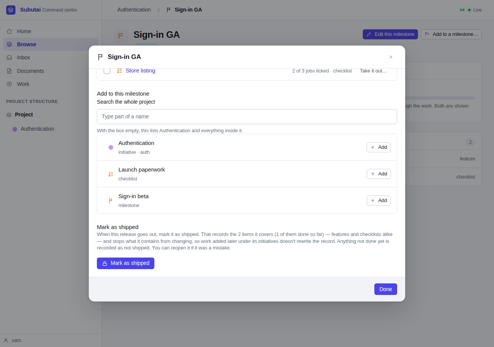

**Mark as shipped** was pressed with *Take the screenshots* still open. The
notice says the record holds 2 items, 1 of them done, and that "the one not
done is recorded as not shipped." The checklist stays unticked in the shipped
milestone.

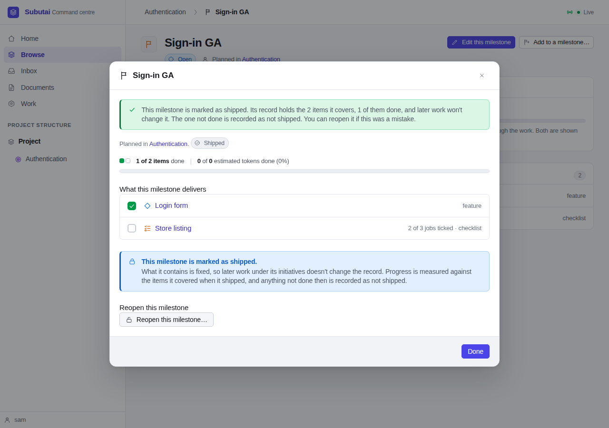

The `milestone.locked` audit row names it (SD-4):

```
not_shipped: [{"id": "01a0e8ee-…", "jobs": 3, "name": "Store listing", "type": "checklist", "ticked": 2}]
```

## The audit trail

Every act is on the trail under the actor who made it, and every tick and
untick says which surface it came through
([`audit.txt`](walkthrough-spec-014/audit.txt)):

```
          kind          |   actor    | via | count
------------------------+------------+-----+-------
 checklist.created      | chat-agent |     |     1
 checklist.created      | sam        |     |     1
 job.added              | chat-agent |     |     3
 job.added              | sam        |     |     3
 job.moved              | chat-agent |     |     1
 job.moved              | sam        |     |     1
 job.ticked             | chat-agent | mcp |     3
 job.ticked             | sam        | ui  |     3
 job.unticked           | chat-agent | mcp |     1
 milestone.created      | chat-agent |     |     1
 milestone.created      | sam        |     |     1
 milestone.locked       | sam        |     |     1
 milestone.member_added | chat-agent |     |     2
 milestone.member_added | sam        |     |     2
```

and each relayed act keeps the person's words:

```
             job             |                            quote
-----------------------------+--------------------------------------------------------------
 Write the store description | The store description is written and marketing signed it off
 Choose the age rating       | We went with 4+
 Choose the age rating       | Hold on, legal want 12+ because of the chat feature
 Choose the age rating       | Age rating is done, it's 12+
```

## Found on the way

**Closing an editor sent the person to the wrong page.** This predates M5; it
came with M4's editors. Every page body is `hx-boost`ed, so after a form post
such as **New checklist** or a tick, HTMX put the post's route
(`/ui/checklist/new`, `/ui/job/tick`) in the address bar. When an editor then
closed after a change, it reloaded that address, which redirects to `/ui`. The
first run of this walkthrough stopped there. Pages rendered in answer to a
boosted post now send `HX-Push-Url` with their own address, so the reload
lands where the person was; `TestUIChecklists` checks the header. It fixes the
same path for milestones and roadmaps.

## Tests

`go vet ./...` is clean and `go test -race -count=1 ./...` passes, with the
integration tests run against Postgres, not skipped. The new tests:

| Test | What it covers |
|---|---|
| `TestChecklistStore` | FR-1: owners, the table's CHECKs, adding, editing, moving and removing jobs with dense positions, ticking and unticking with who, how and the words, the refusals, ambiguous titles |
| `TestChecklistProgressAndShipping` | FR-2: items, SD-2's resolution, G4 on a lone checklist, the snapshot, `not_shipped`, a shipped record that doesn't go backwards, reopening |
| `TestChecklistCandidates` | FR-6.1: the picker's checklist branch |
| `TestChecklistPagesRender` | The page, the editor, the plan section and the milestone editor, in markup: checkboxes, relayed words, ends of the list, no table, no typed path |
| `TestUIChecklists` | Every UI handler, against Postgres, including stale pages and `HX-Push-Url` |
| `TestMCPChecklistTools` | Every MCP tool and the relay, with the refusals and the audit trail |
| `TestMCPAdvertisedToolSetIsExactlyTheAuthoringSet` | The thirty-three tools, named on purpose, and three tick names that must not exist |
| `TestG4` | The three refusals, word for word, counting items |
