# Walkthrough — SPEC-015, documents with identity

**Date:** 2026-09-28
**Spec:** [SPEC-015](specs/SPEC-015-documents-with-identity.md), draft for
Sam's approval
**Review:** [REVIEW-015](reviews/REVIEW-015-documents-with-identity.md)
**Handoff:** [M8 handoff](notes/handoff-M8-2026-09-28.md)

This is the definition-of-done demo (SPEC-015 DoD 3). It ran a throwaway
project on a real Postgres with no AI provider, because nothing in M8 needs
one. The project lived at `/var/tmp/m8demo`, a short path, because a unix
socket path can't be longer than 108 bytes. The scripts are in
[walkthrough-spec-015/](walkthrough-spec-015/):

- `setup.sh` builds `./cmd/subutai`, makes the project with `subutai init`,
  commits two existing documents to adopt later, and serves it on
  `127.0.0.1:8815`;
- `walk.js` drives the browser with Playwright and the pre-installed Chromium,
  runs the `git mv` in the middle, and takes the screenshots.

```sh
bash docs/walkthrough-spec-015/setup.sh
node docs/walkthrough-spec-015/walk.js docs/walkthrough-spec-015
```

The two existing documents were this repository's own
`DEC-005-the-orchestration-boundary.md`, copied byte for byte, and a design
note written as if before Subutai came along.

## 1. Creating work creates its documents

The project page's menu has **New initiative**. Its dialog now has a ticked
**Start a design document** box, with a sentence saying what it does and when
to untick it.

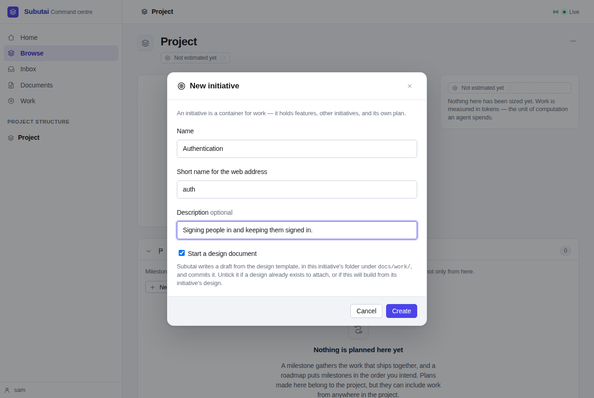

Creating it says what was made, by ID, and where its design went:

> Initiative created: INIT-001 Authentication. Its design document was
> started at docs/work/INIT-001-auth/INIT-001-design.md, from the template,
> and committed.

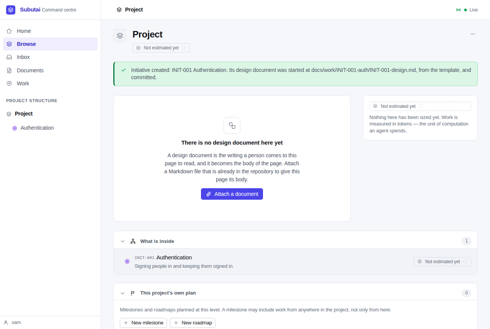

The initiative's page leads with its ID, in the title (`INIT-001
Authentication — Subutai`), the header and the breadcrumb. Its body is the
starter design, from the project's template, with the name and owner filled
in and the rest of the template left for a person to write.

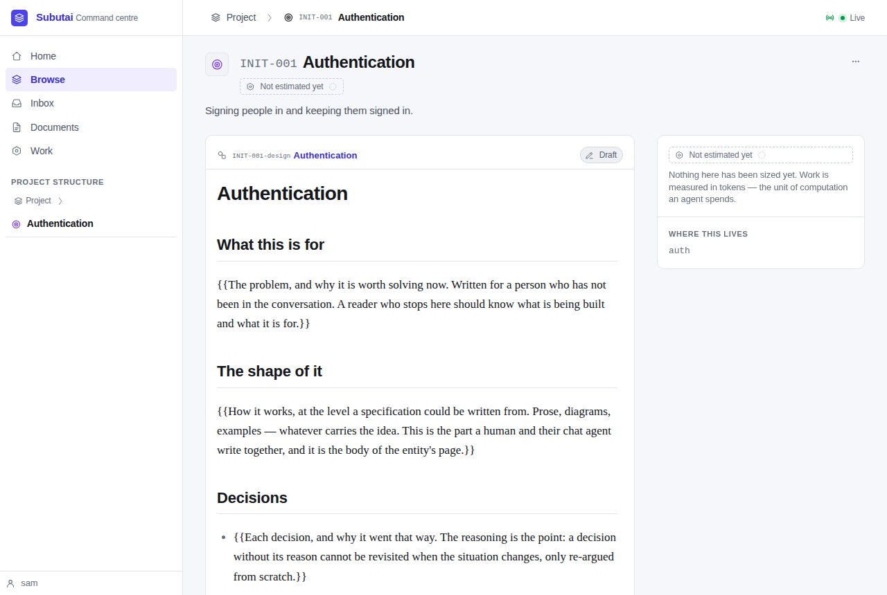

A feature made from there gets the same: `FEAT-001`, with its design in the
initiative's folder. The initiative's list of what is inside shows the
feature's ID.

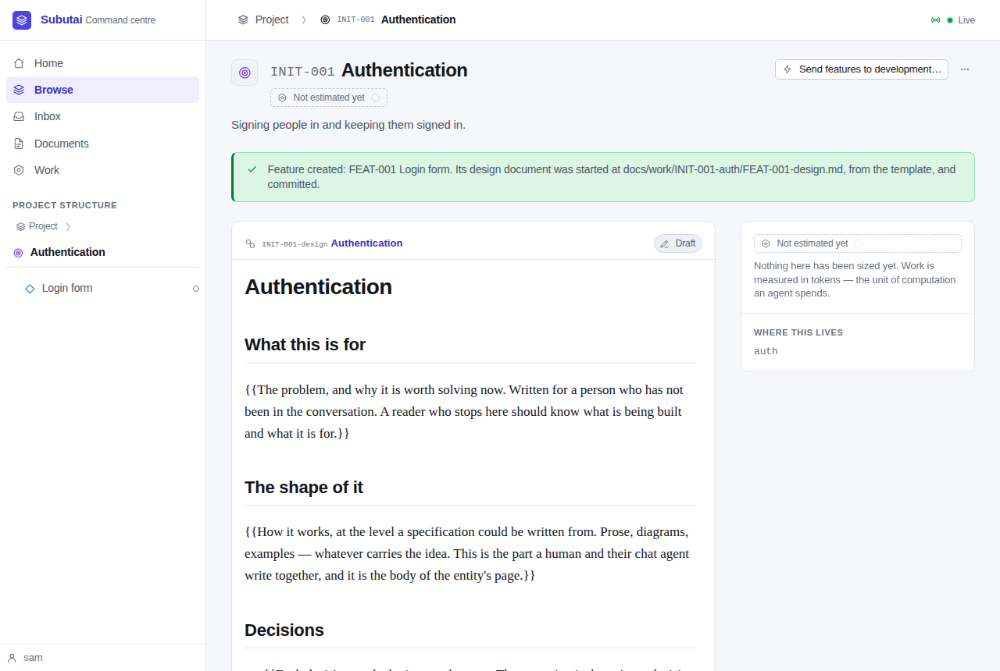

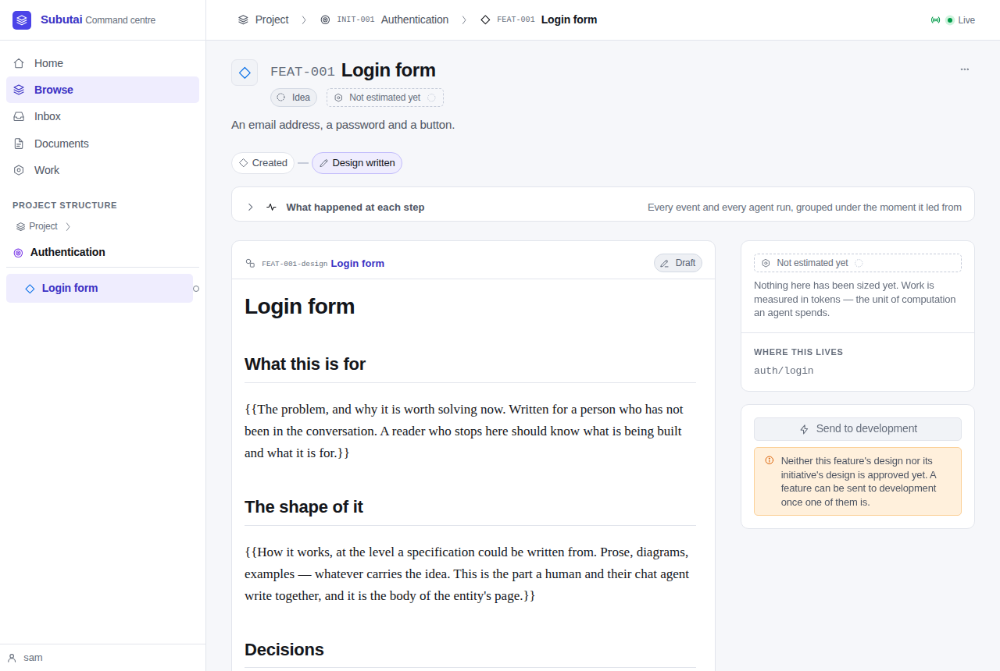

Both designs were committed by Subutai, so the checkout stayed clean:

```
c5e2b1d subutai: subutai: start the design of FEAT-001, Login form
11509da subutai: subutai: start the design of INIT-001, Authentication
0cfcea2 Demo: existing documents

docs/work/INIT-001-auth/FEAT-001-design.md
docs/work/INIT-001-auth/INIT-001-design.md
```

## 2. Moving a file doesn't detach it

The walk then did what a person does in their own editor:

```sh
mkdir -p docs/designs
git mv docs/work/INIT-001-auth/FEAT-001-design.md docs/designs/login-form.md
git commit -m "Move the login design"
```

The post-commit hook told the server, which read the file's front matter,
found `id: FEAT-001-design` and `revision: 1`, and moved the document's row to
the new path. The server's log:

```
level=INFO msg="followed a moved document" id=FEAT-001-design
  from=docs/work/INIT-001-auth/FEAT-001-design.md to=docs/designs/login-form.md
```

The feature page still has its design:


`/ui/id/FEAT-001-design` goes to the document, now at
`docs/designs/login-form.md`, and the document's header gives its ID and
revision. The old address, `/ui/d/docs/work/INIT-001-auth/FEAT-001-design.md`,
redirects there too.

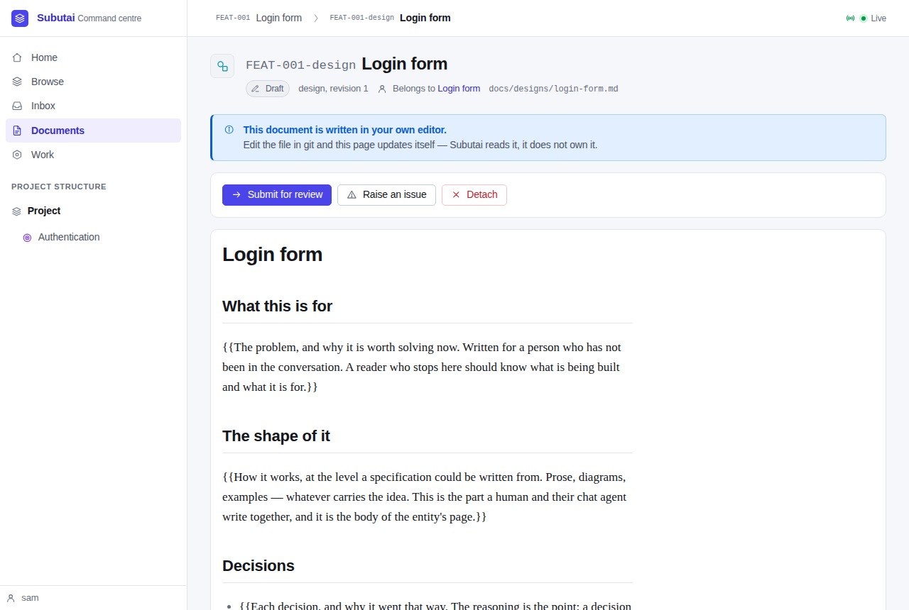

The database afterwards: one row for the design, at its new path, and one
`document.moved` audit row by `git-watcher`.

```
INIT-001-design|1|draft|docs/work/INIT-001-auth/INIT-001-design.md
FEAT-001-design|1|draft|docs/designs/login-form.md
document.moved|git-watcher|docs/work/INIT-001-auth/FEAT-001-design.md|docs/designs/login-form.md
```

## 3. Adopting a file where it sits

The project page's menu has **Adopt a file…**. The dialog takes the file's
path, its kind, and whether it was already approved.

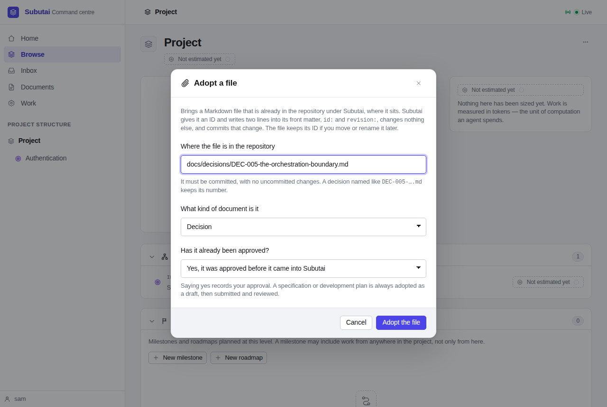

DEC-005 kept its number, and the notice says what was done:

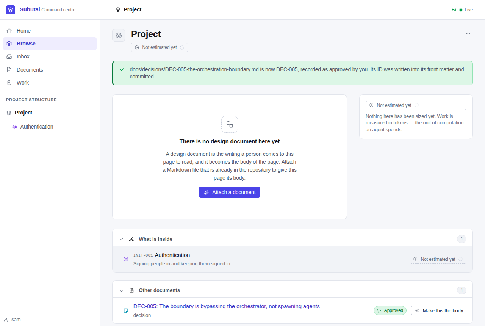

Subutai's commit touched nothing but the new front matter: five lines added,
none changed.

```
d592b1c subutai: subutai: adopt docs/decisions/DEC-005-the-orchestration-boundary.md as DEC-005

 docs/decisions/DEC-005-the-orchestration-boundary.md | 5 +++++
 1 file changed, 5 insertions(+)
```

```
---
id: DEC-005
revision: 1
---

# DEC-005: The boundary is bypassing the orchestrator, not spawning agents
```

The decision's page. Its title is its first heading, because the file has no
`title:`. The heading already starts with the number, so the ID label isn't
repeated before it.

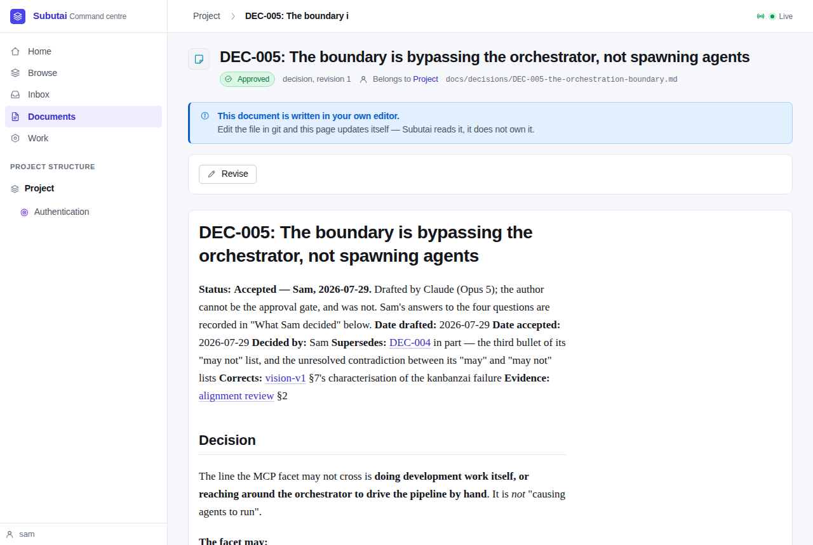

The older note was adopted on the initiative as a draft, and became
`INIT-001-note`:

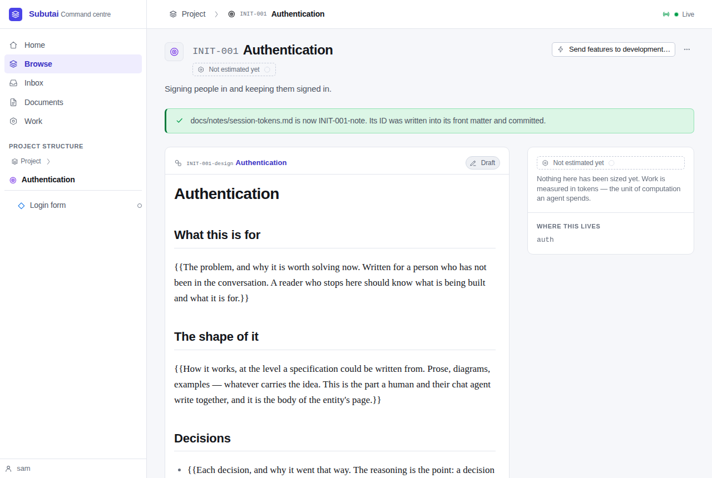

## 4. IDs in lists

The documents page lists every document with its ID:

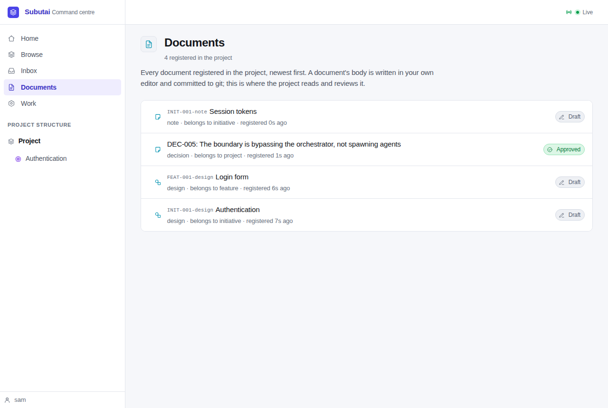

Home shows them too. `/ui/id/feat-001`, in lower case, lands on
`/ui/f/auth/login`.

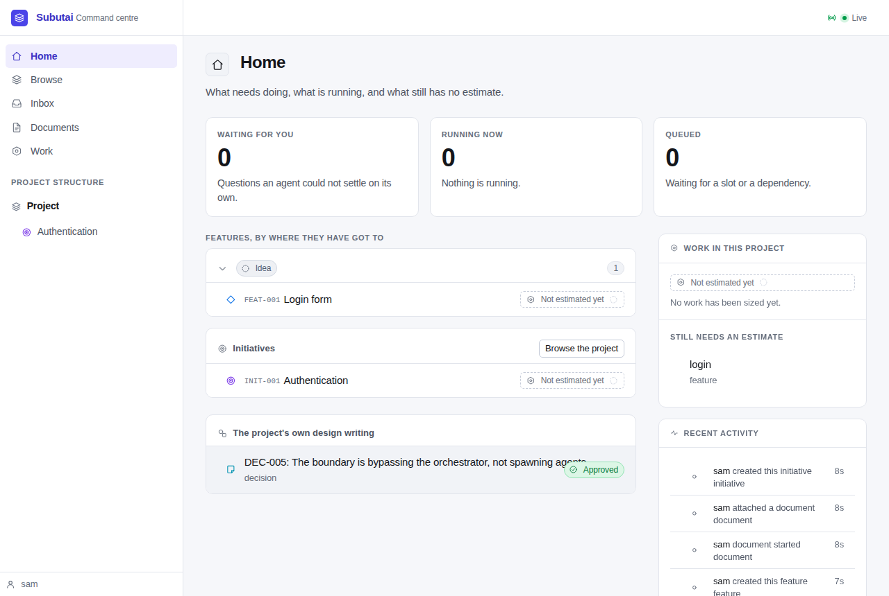

## The suite

- `go vet ./...` is clean.
- `go test -race -count=1 -v ./...` passed: 243 top-level tests. The only
  skip was `TestDemoM6`, the M6 demo harness, which runs only when
  `SUBUTAI_M6_DEMO` names a directory. No integration test skipped.

The M8 tests are in `internal/store/identity_test.go`,
`internal/server/integration_identity_test.go`, `internal/ident/` and
`internal/content/identity_test.go`. Between them they cover:

- minting and backfill, including a checklist table made before or after
  `0010`;
- moves, renames, copies, and moves made with no hook;
- adopt, including this repository's DEC-001 to DEC-007 and every refusal;
- creating work with and without its design;
- successor revisions and archive names;
- documents with no ID, unchanged.

## What the walk didn't show

These are covered by the suite rather than the browser:

- **Revise** on a document with an ID gives the successor revision 2. On
  approval the old revision is archived as
  `docs/_superseded/INIT-001-design.r1.md`.
- **Give it an ID** on a document attached by its path. Also
  **This was already approved** on an adopted draft of a type with no
  template.
- **Detach** of a design with an ID takes the ID out of the file and commits
  that change.
- **MCP**: `adopt_document`, and `create_*`'s `design_document`; paths that
  take an ID, such as `get_feature(path: "FEAT-001")`; and results with IDs.
