# Walkthrough — SPEC-016, edit in the browser

**Date:** 2026-09-28
**Spec:** [SPEC-016](specs/SPEC-016-edit-in-the-browser.md), draft for Sam's
approval
**Review:** [REVIEW-016](reviews/REVIEW-016-edit-in-the-browser.md)
**Handoff:** [M9 handoff](notes/handoff-M9-2026-09-28.md)

This is the definition-of-done demo (SPEC-016 DoD 3). It ran a throwaway
project on a real Postgres with no AI provider, because nothing in M9 needs
one. The project lived at `/var/tmp/m9demo`, a short path, because a unix
socket path can't be longer than 108 bytes. The operator, `ui_actor`, was
`sam`. The scripts are in [walkthrough-spec-016/](walkthrough-spec-016/):

- `setup.sh` builds `./cmd/subutai`, makes the project with `subutai init`,
  and serves it on `127.0.0.1:8816`;
- `walk.js` drives the browser with Playwright and the pre-installed Chromium,
  edits the file in a shell in the middle, and takes the screenshots.

```sh
bash docs/walkthrough-spec-016/setup.sh
node docs/walkthrough-spec-016/walk.js docs/walkthrough-spec-016
```

The walk starts by creating an initiative, Authentication, whose starter
design M8 writes and commits: `docs/work/INIT-001-auth/INIT-001-design.md`.

## 1. Edit a draft, and Save & commit

The document page's old banner, "This document is written in your own
editor", is now the edit banner. It still says the file can be edited
anywhere, and it holds the **Edit** button.

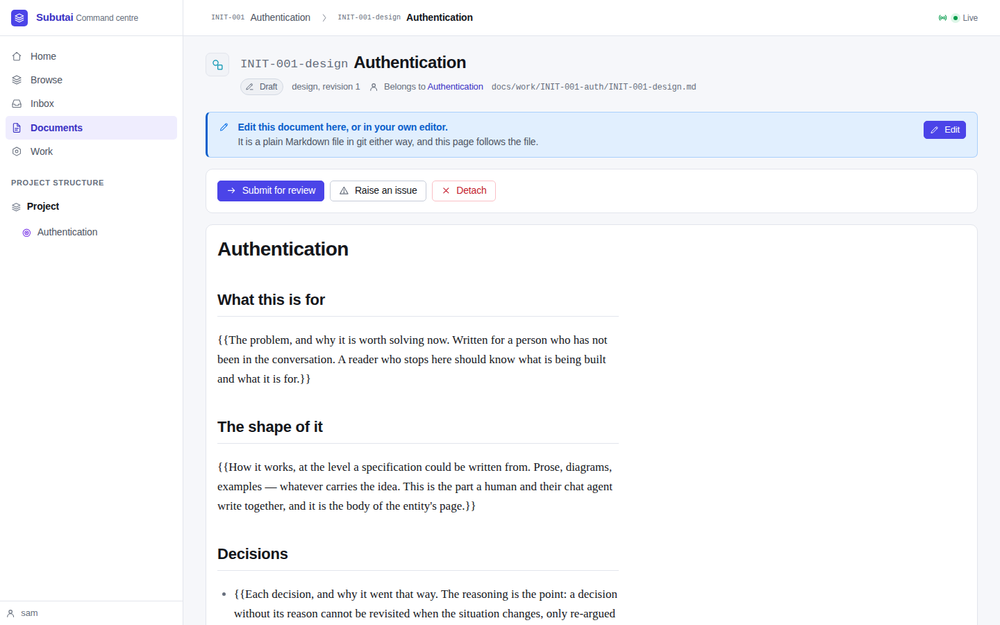

**Edit** opens the editor. The head shows the document's ID, title, state,
type, revision and path, and a line says what editing means in this state: "This
document is a draft, so it is edited in place." The text box holds the whole
file, front matter and all. Under it, a hint names the two identity lines to
keep.

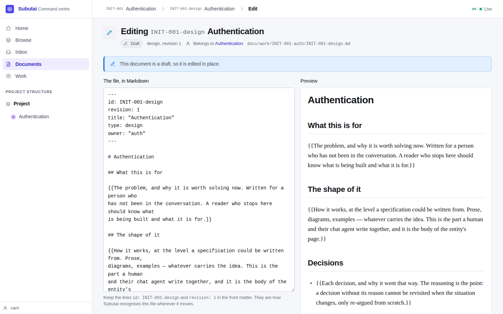

Filling in the template's placeholders, the preview follows as you type. It
uses the document page's own renderer, so it looks as the page will.

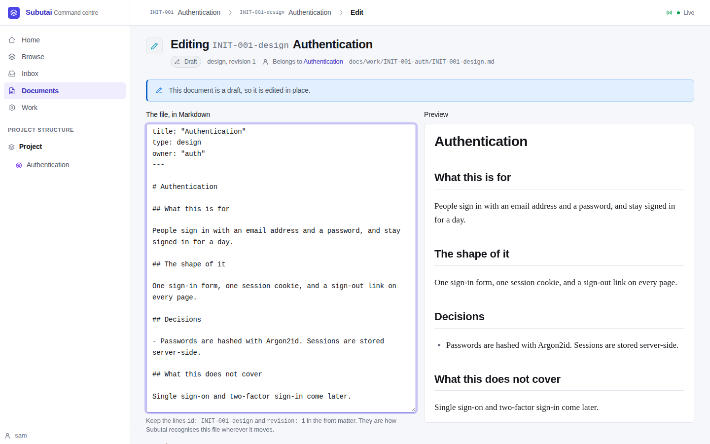

With a commit message of "Fill in the authentication design", **Save &
commit** writes the file, commits it alone, and returns to the document page:

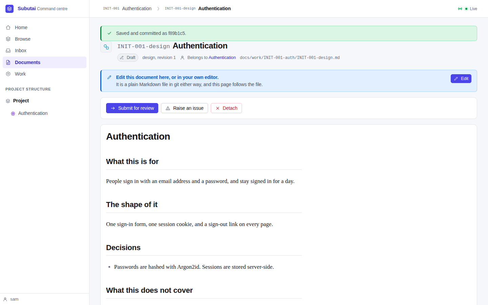

The commit, from `git log` and `git show --stat` in the demo project:

```
f89b1c5  author: sam <sam@localhost>  committer: subutai <subutai@localhost>
    Fill in the authentication design

docs/work/INIT-001-auth/INIT-001-design.md, draft, revision 1.
Saved from the Subutai web editor by sam.

 docs/work/INIT-001-auth/INIT-001-design.md | 16 ++++------------
 1 file changed, 4 insertions(+), 12 deletions(-)
```

One file, the operator as author, and Subutai as committer.

## 2. The same file, edited in a shell: the conflict

The editor is opened again and a sentence typed at the end: "A sentence typed
in the browser." Meanwhile a shell changes the same file, as vim would: "for a
day" becomes "for a week", and a line is added at the end.

Within ten seconds the editor notices, before anyone presses a button:

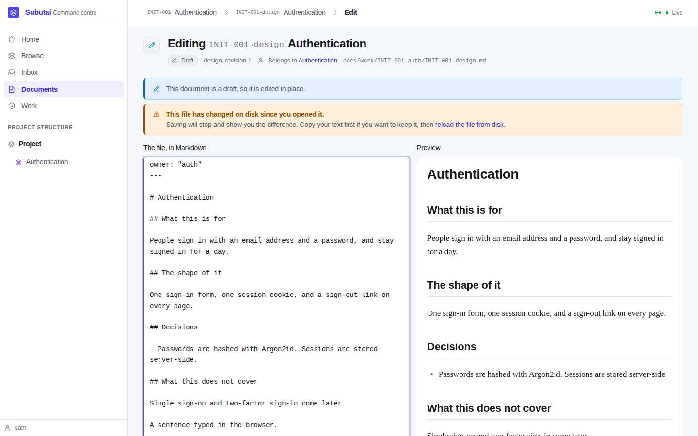

Pressing **Save** anyway stops. Nothing is written:

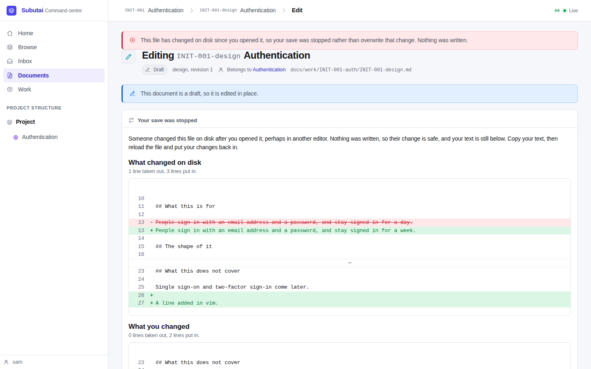

The conflict panel shows both sides as line diffs from the version the editor
opened. **What changed on disk** has the shell's two changes. **What you
changed** has the typed sentence. Lines are marked `-` and `+` as well as
coloured.

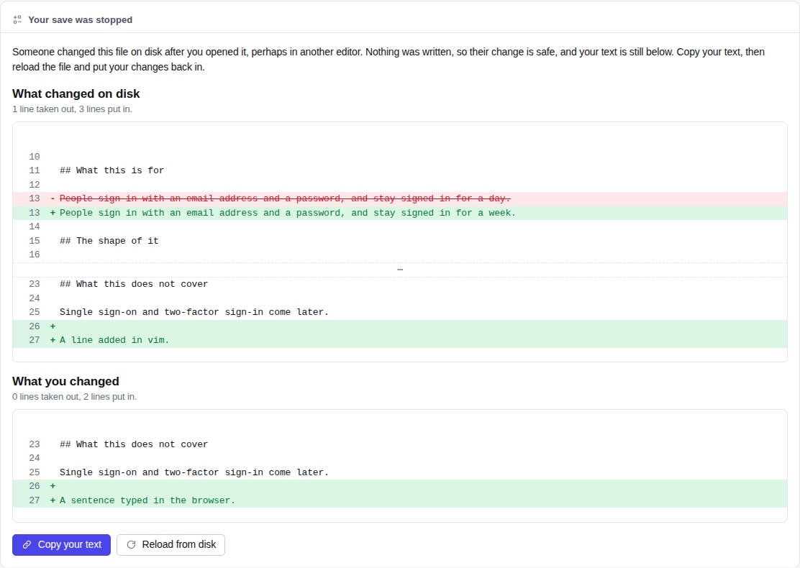

The file on disk still ends with the shell's line, not the browser's:

```
Single sign-on and two-factor sign-in come later.

A line added in vim.
```

**Copy your text** puts the text on the clipboard. After a little more typing,
**Reload from disk** asks first, because the text isn't saved:

> Your text isn't saved. Leave the editor and lose it?

(Playwright records the question and accepts it. A native dialog doesn't
appear in a screenshot.) The editor reopens on the shell's version:

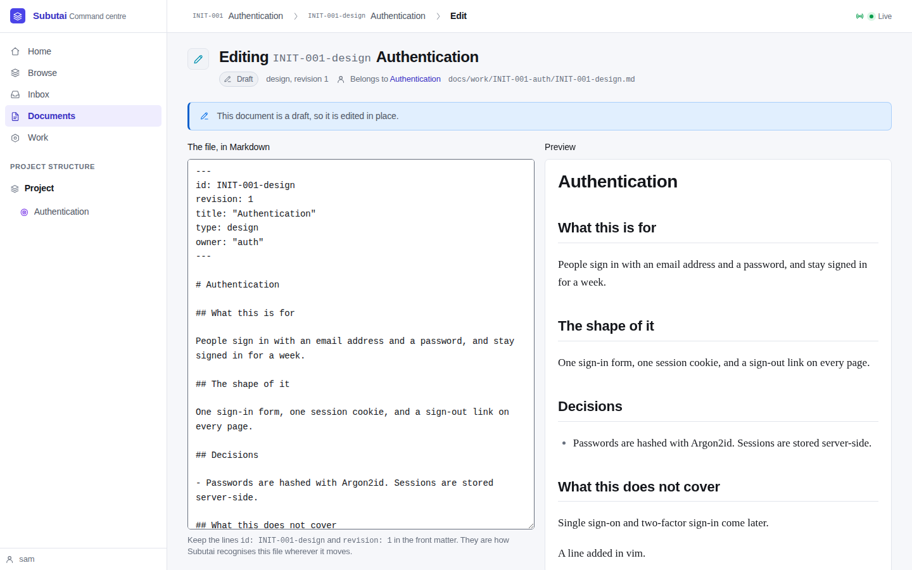

## 3. The ID is kept

Deleting the `id: INIT-001-design` line and saving is refused, with the text
kept in the box:

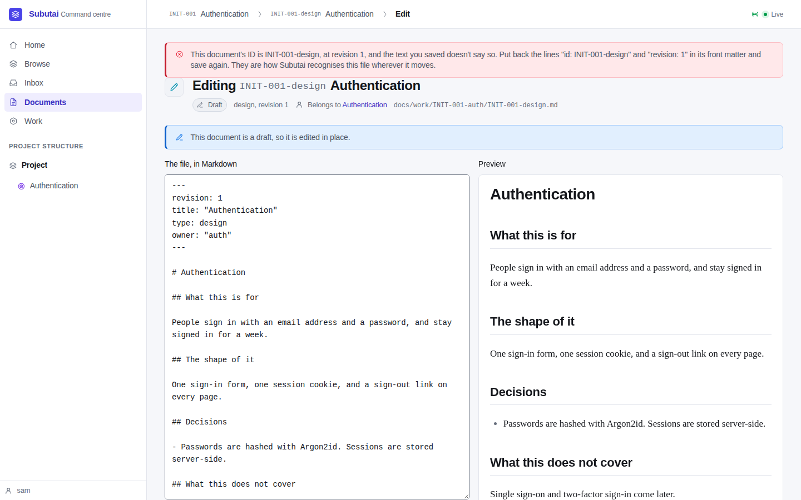

> This document's ID is INIT-001-design, at revision 1, and the text you saved
> doesn't say so. Put back the lines "id: INIT-001-design" and "revision: 1"
> in its front matter and save again. They are how Subutai recognises this
> file wherever it moves.

## 4. Edit an approved design: the successor

The shell's change is committed, and the design is submitted and approved from
its page. Its edit button now says what it will do: **Edit — starts a
revision**.

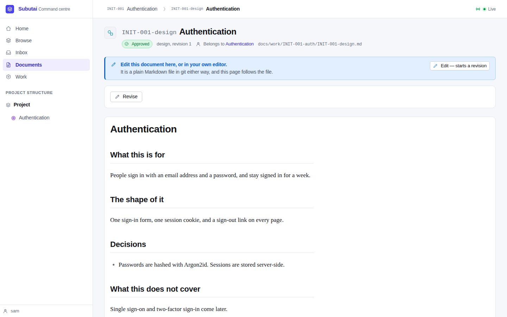

It doesn't open a text box. It says that the document isn't changed in place,
where the working copy will be and at which revision, and what approving a
revised design does: the cascade.

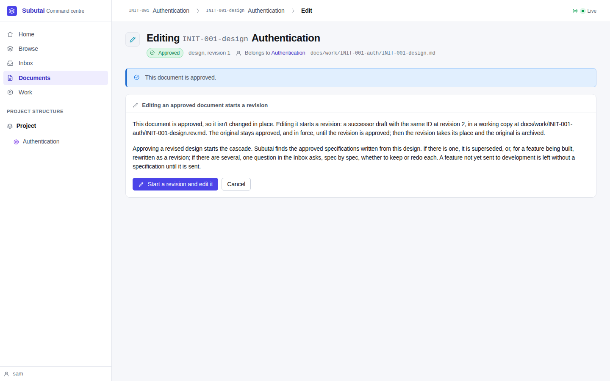

**Start a revision and edit it** runs the same Revise as the page's own
button, and opens the successor's editor: a draft, revision 2, at
`INIT-001-design.rev.md`, with `revision: 2` already in its front matter.

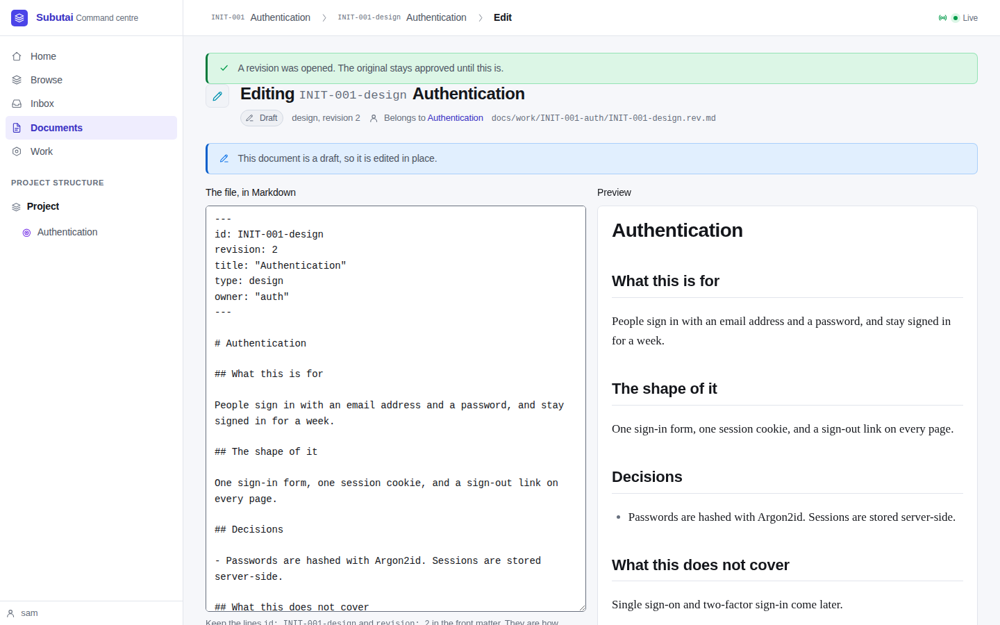

A section is added and saved with **Save & commit**. The working copy had never
been committed, but Subutai wrote it, so it is committed with the edit:


```
d2d161a  author: sam  committer: subutai
    Edit INIT-001-design in the browser
 docs/work/INIT-001-auth/INIT-001-design.rev.md | 31 ++++++++++++++++++++++++++
```

The original's page now offers **Edit the open revision**, beside the existing
**Open the revision in progress**:

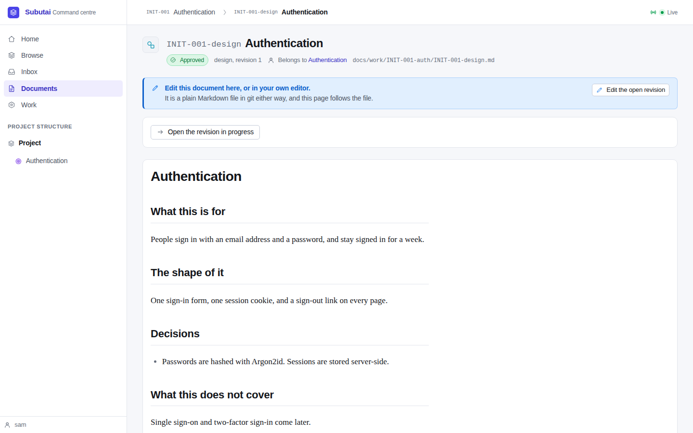

Submitting and approving the revision moves it into the original's place, and
archives the original:


```
39b0e9a subutai: subutai: revision of docs/work/INIT-001-auth/INIT-001-design.md approved; predecessor archived
d2d161a sam: Edit INIT-001-design in the browser
a071996 Demo: A week, not a day
 .../INIT-001-design.rev.md => _superseded/INIT-001-design.r1.md} | 6 +-----
 docs/work/INIT-001-auth/INIT-001-design.md                       | 6 +++++-
```

(The log line reads "author: subject", and Subutai's own subjects start
"subutai:".) The takeover commit holds exactly the two moved paths (git's rename detection
pairs them up oddly in `--stat`, but the canonical file holds revision 2 and
the archive revision 1). The working tree is clean afterwards.

## What the walkthrough found

- **The Edit button's icon was invisible**: a banner's icon colour overrode
  the primary button's. A one-line CSS rule fixes it, and the screenshots here
  are from after the fix.
- Nothing else. The behaviours the walk doesn't show are covered by the
  integration tests (the handoff lists them).
