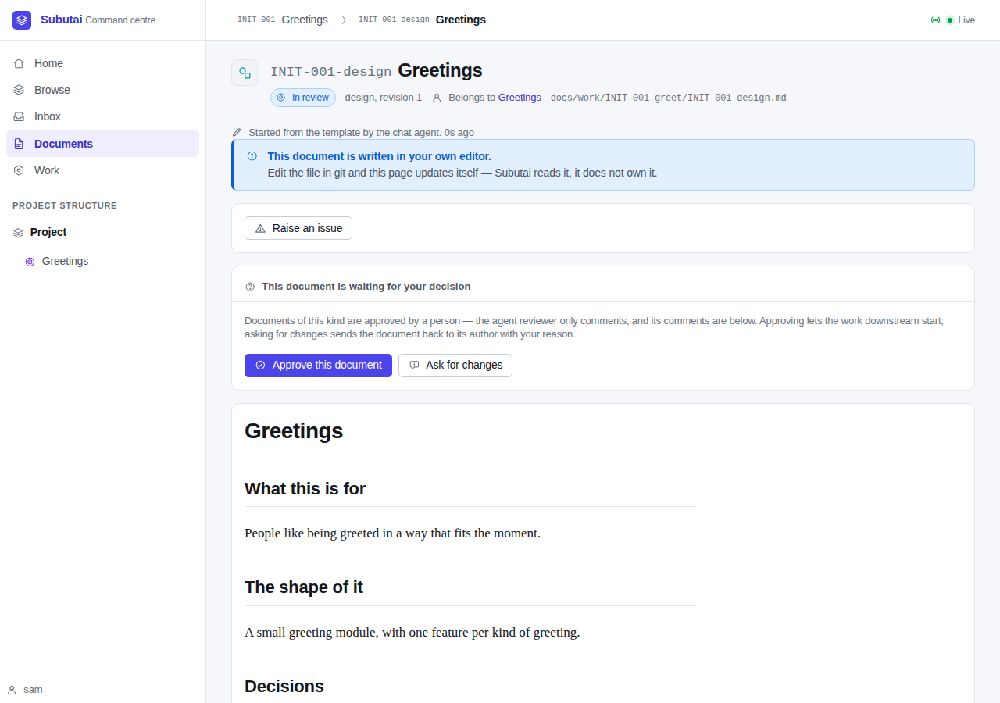
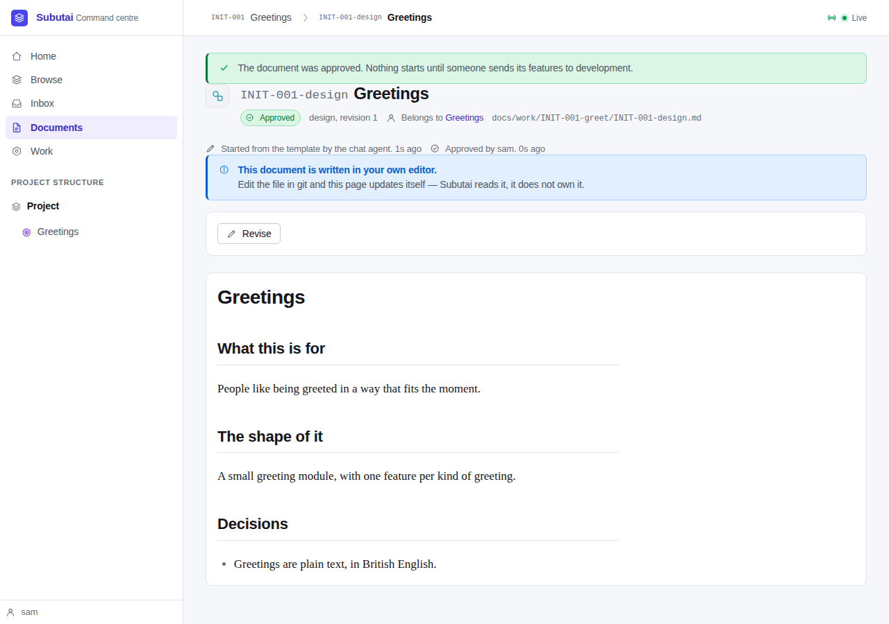
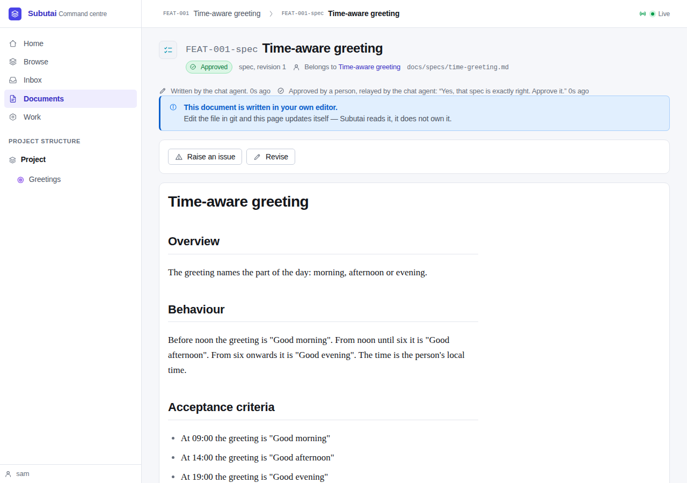
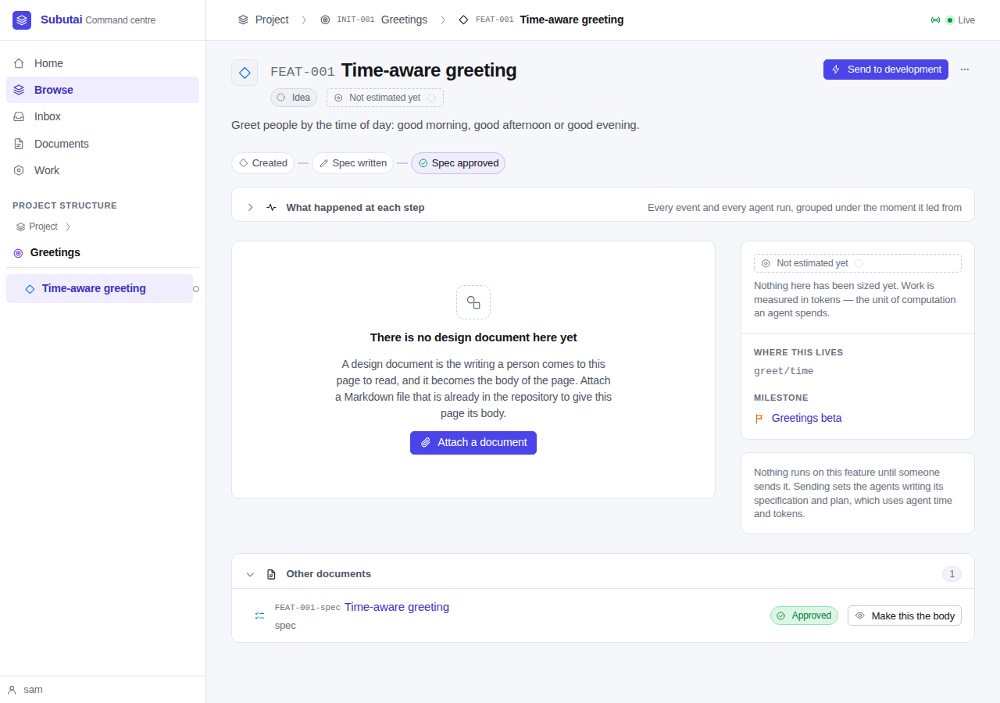
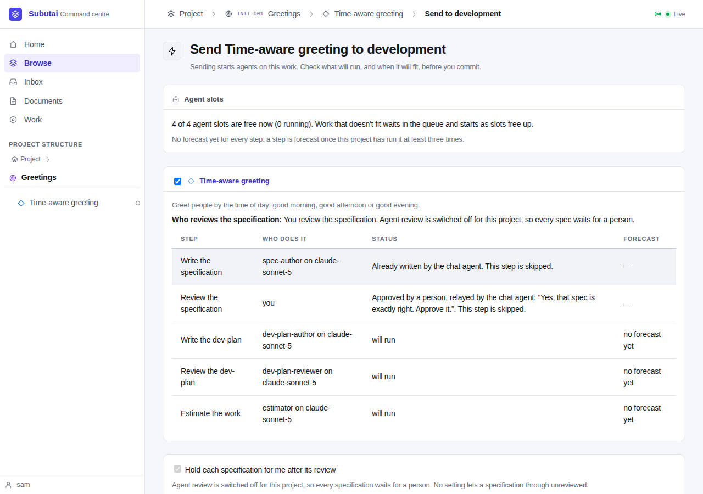
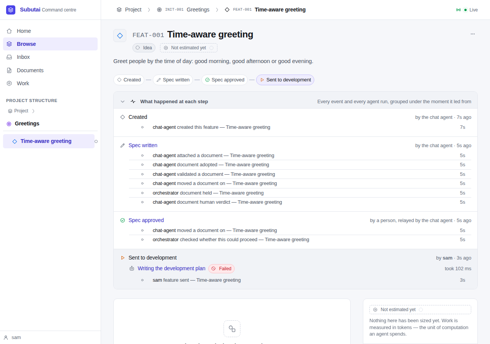
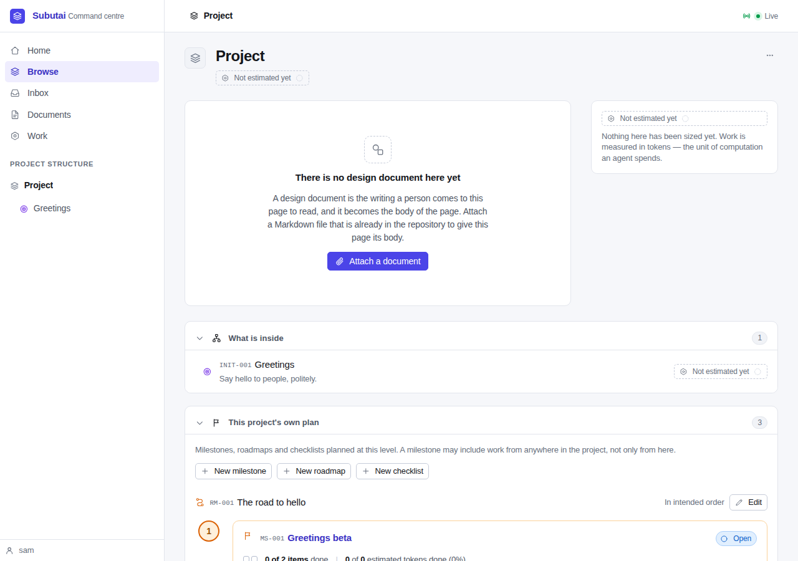
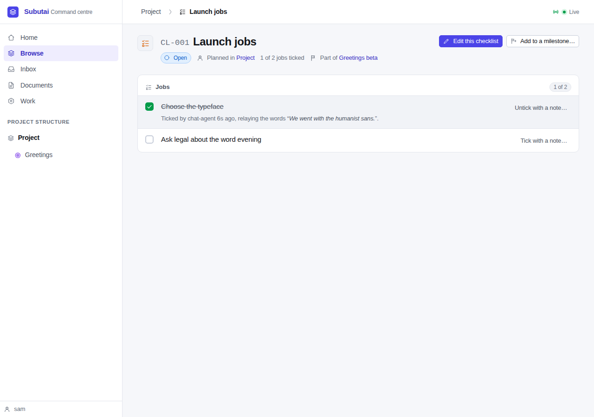
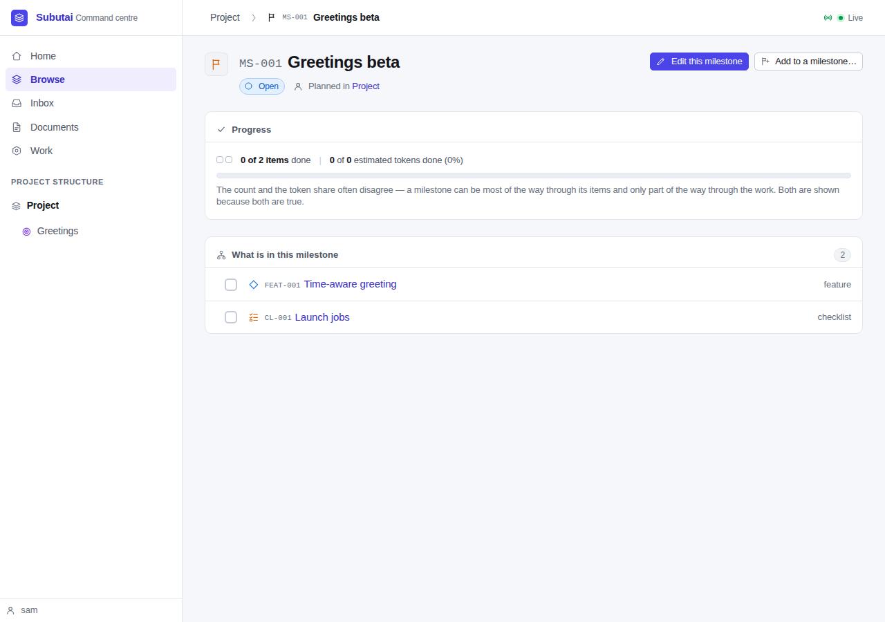

# Walkthrough — SPEC-017, chat as a proper seat

**Date:** 2026-09-28
**Spec:** [SPEC-017](specs/SPEC-017-chat-as-a-proper-seat.md), draft for
Sam's approval
**Review:** [REVIEW-017](reviews/REVIEW-017-chat-as-a-proper-seat.md)
**Handoff:** [M10 handoff](notes/handoff-M10-2026-09-28.md)

This is the definition-of-done demo (SPEC-017 DoD 3). It ran a throwaway
project on a real Postgres **with no AI provider**. The project lived at
`/var/tmp/m10demo`, a short path, because a unix socket path can't be longer
than 108 bytes. The chat agent's side ran as plain MCP JSON-RPC calls with
`curl`, which is what a chat AI sends. The person's side ran in the browser,
with Playwright and the pre-installed Chromium.

The scripts are in [walkthrough-spec-017/](walkthrough-spec-017/):

- `setup.sh` builds `./cmd/subutai`, makes the project with `subutai init`,
  and serves it on `127.0.0.1:8817`. The provider key is a dummy, and **agent
  spec review is switched off** in this project, so a spec waits for a person
  instead of a model.
- `chat.sh` is the chat agent's first half: it lists its tools, plans an
  initiative and a feature, writes the design with the person, and submits it.
- `walk.js` is the person, in the browser. Halfway through, it runs
  `chat2.sh`, the chat agent's second half: write the spec, adopt it, submit
  it, carry the person's approval, and plan a milestone, a roadmap and a
  checklist.

```sh
bash docs/walkthrough-spec-017/setup.sh
bash docs/walkthrough-spec-017/chat.sh
node docs/walkthrough-spec-017/walk.js docs/walkthrough-spec-017
```

The chat agent's output is kept beside the screenshots:
[chat-output.txt](walkthrough-spec-017/chat-output.txt),
[chat2-output.txt](walkthrough-spec-017/chat2-output.txt) and
[read-tools-output.txt](walkthrough-spec-017/read-tools-output.txt).

**What needs a model, and where it is proved instead.** Without a provider,
no agent reviews the spec, and nothing writes the plan. So this demo has a
person approve the spec, relayed from chat, where the goal has the spec
reviewer approve it. The path with the reviewer is proved by
`TestChatWrittenSpecFlowsToStartBuilding`, with the mock provider against real
Postgres. It covers all eight steps of SPEC-017 FR-6:
1. the chat agent writes and commits a spec;
2. it adopts it;
3. it submits it with no quote, and the reviewer approves;
4. a person presses Send;
5. the send screen says spec writing and review are skipped;
6. the plan is written, reviewed and estimated;
7. the work stops at Start building;
8. the spec says the chat agent wrote it and the spec reviewer approved it.

## 1. The chat agent's new tools

The chat agent sees 37 tools. Three are new in M10: `submit_for_review`,
`get_timeline` and `get_agent_run`. The tool-set test names each one, with a
comment saying why it is there.

It plans an initiative and a feature. The initiative's starter design comes
back with its writer:

```
» create_initiative {"slug":"greet","name":"Greetings",…}
  {"id": "INIT-001", "design": "docs/work/INIT-001-greet/INIT-001-design.md",
   "written_by": "Started from the template by the chat agent."}
```

With the person, it writes the design into that file, commits it, and hands
it in by its ID, with no quote:

```
» submit_for_review {"document":"INIT-001-design"}
  It is in review, and waits for a person to approve it, on its page or by telling you.
```

## 2. A person approves the design

The design's page says who started it, directly under the heading. It is in
review, waiting for a person.



Sam presses **Approve this document**. The line underneath now says who
approved it.



## 3. The chat agent writes the spec, and hands it in

`chat2.sh` writes `docs/specs/time-greeting.md`, commits it, and adopts it for
the feature. The file gets its ID, `FEAT-001-spec`, and the result says who
wrote it:

```
» adopt_document {"path":"docs/specs/time-greeting.md","doc_type":"spec",…,"owner_path":"FEAT-001"}
  {"id": "FEAT-001-spec", "state": "draft", "written_by": "Written by the chat agent."}
» submit_for_review {"document":"FEAT-001-spec"}
  Agent review is switched off for this project, so the specification waits for a person to approve it.
```

Submitting it again is refused, because a fresh review is the person's call.
A relay still needs the person's words:

```
» submit_for_review {"document":"FEAT-001-spec"}
  refused: This document is already in review. A fresh review is a person's call: relay it with relay_review_request and their words.
» relay_verdict {"path":"FEAT-001-spec","verdict":"approve"}
  refused: the person's words are required in quote: …
» relay_verdict {"path":"FEAT-001-spec","verdict":"approve","quote":"Yes, that spec is exactly right. Approve it."}
  {"done": "recorded the person's verdict: approve",
   "last_verdict": "Approved by a person, relayed by the chat agent: “Yes, that spec is exactly right. Approve it.”"}
```

The relay tools now take a document's ID as well as its path (SPEC-017
FR-3.1). `get_feature` gives each document's `written_by` and
`last_verdict`. The same sentences appear on the page.



## 4. The send screen skips spec writing

The feature's page offers **Send to development**.



The send screen says both spec steps are done, who did them, and that they
are skipped. The plan, its review and the estimate will run.



Sam presses **Send**. The timeline now reads *Created · Spec written · Spec
approved · Sent to development*.
- Under **What happened at each step**, *Spec written* is by the chat agent.
- *Spec approved* is "by a person, relayed by the chat agent", not the chat
  agent's own verdict.
- The plan writer's run is under *Sent to development*. With a dummy key it
  fails at the provider.
- What a real model does next is proved by the mock-provider test above.



## 5. Reading the work from chat

`get_timeline` gives the same story to the chat agent:

```
get_timeline FEAT-001:
  Created — the chat agent
  Spec written — the chat agent
  Spec approved — a person, relayed by the chat agent
  Sent to development — sam
```

`get_agent_run` on the failed plan run gives what it was, its conclusion (the
provider's 401), one turn of transcript, and a note that tool results are
left out unless asked for. The full answer is in
[read-tools-output.txt](walkthrough-spec-017/read-tools-output.txt).

## 6. IDs in and out of chat

The chat agent plans a milestone, a roadmap and a checklist. Each result
gives the ID as `id` and the row id as `row_id`. Every later call names them
by ID:

```
» create_milestone {"name":"Greetings beta"}
  {"id": "MS-001", "row_id": "01a0e94d-…"}
» place_roadmap_entry {"roadmap":"RM-001","milestone":"MS-001"}
» add_milestone_member {"milestone":"MS-001","member_type":"checklist","member":"CL-001"}
» relay_tick_job {"checklist":"CL-001","job":"Choose the typeface","ticked":true,"quote":"We went with the humanist sans."}
» get_milestone {"milestone":"MS-001"}
  [["FEAT-001", "feature", "Time-aware greeting"], ["CL-001", "checklist", "Launch jobs"]]
```

The project's plan section shows the IDs, on the roadmap and in the roadmap
spine.



`/ui/id/CL-001` goes to the checklist, whose heading carries its ID.



The milestone lists what it delivers by ID.



## The suite

`go vet ./...` is clean. `go test -race -count=1 -v ./...` passes against the
session's Postgres, with the integration tests running. Two tests skip, as on
the base branch: the opt-in M6 demo, and a store test that only applies
before M5's table exists.

The new tests:

| Test | What it proves |
|---|---|
| `TestChatWrittenSpecFlowsToStartBuilding` | FR-6: the whole path with the mock reviewer, the send screen's skips, the page's lines, and `get_timeline` and `get_agent_run` afterwards |
| `TestChatAttachedSpecAndSubmitRefusals` | FR-1.2's refusals, an attached spec credited to chat, and SD-11 (an ID names the open revision) |
| `TestVerdictsRecordWhoAndHow` | relayed approval and send-back, an issue recording no verdict, a held approval and its relayed release, and the timeline crediting a person |
| `TestEscalationAndUIVerdicts` | an escalation answer recording the review it ruled on; a design approved in the web UI; "Added by sam" for a design added through the API |
| `TestWritersRecordWhoAndHow` | an authored spec's role, model and run; a revision opened by a relayed issue; a starter design from chat; a note attached in the UI |
| `TestSendScreenWarnsOfAnUnsubmittedDraft` | FR-5.2 |
| `TestIDsInAndOutOfTheChatTools` | FR-3: IDs in results and lookups, the plan section, the checklist page, `/ui/id/CL-…`, and a relay by document ID |
| `TestBackfillAtBootCreditsOlderDocuments` | FR-2.8's second pass, and that running it twice adds nothing |
| `TestMigration0011ReadsBackTheTrail` | FR-2.8's first pass, on a database written as it was before `0011`, and the relay-needs-a-quote constraint |
| `TestCompactTranscript`, `TestWriterAndVerdictSentences` | SD-10's cuts, and FR-2.4's sentences |
| `TestRelayedVerdictIsAPersons` | FR-2.7, in the timeline package |
| `TestActorNamesMustDiffer` | SD-12 |

Three existing tests changed on purpose:
- `TestMCPAdvertisedToolSetIsExactlyTheAuthoringSet` names the three new
  tools, and its must-not list gains `approve_document`, `submit_document` and
  `submit_review`.
- `TestUIChecklists` expects the checklist heading's ID.
- `TestMCPChecklistTools` reads a checklist's row id from `row_id`.

## What the walk didn't show

- **An agent reviewer's verdict in the browser.** It needs a model. The
  mock-provider test covers it, and the page's line for it ("Approved by the
  spec reviewer (*model*)", with a link to the review) is checked there.
- **The plan, its review, the estimate, and stopping at Start building.** The
  same test covers them.
- **The "0s ago" times.** They come from the page's usual `ago` helper; the
  demo ran in seconds.
