# Walkthrough — SPEC-019, bugs

**Date:** 2026-09-28
**Spec:** [SPEC-019](specs/SPEC-019-bugs.md), **approved by Sam,
2026-09-28** (recorded 2026-10-02)
**Review:** [REVIEW-019](reviews/REVIEW-019-bugs.md)
**Handoff:** [M12 handoff](notes/handoff-M12-2026-09-28.md)

This is the definition-of-done demo (SPEC-019 DoD 3). It ran a throwaway
project on a real Postgres **with no AI provider**. The project lived at
`/var/tmp/m12demo`, a short path, because a unix socket path can't be longer
than 108 bytes. The chat agent's side ran as plain MCP JSON-RPC calls with
`curl`, which is what a chat AI sends. The person's side ran in the browser,
with Playwright and the pre-installed Chromium.

The scripts are in [walkthrough-spec-019/](walkthrough-spec-019/):

- `setup.sh` builds `./cmd/subutai`, makes the project with `subutai init`,
  and serves it on `127.0.0.1:8819`. The provider key is a dummy. The
  project's spending limit is spent before it starts, so work that is sent
  waits in the queue, where it can be seen, instead of calling a model.
- `chat.sh` is the chat agent: it lists its tools, plans an initiative and a
  feature, reports a bug the person mentioned, and tries a triage relay
  without the person's words.
- `walk.js` is the person, in the browser. Partway through, it has the chat
  agent relay a triage decision, quoting the person.

```sh
bash docs/walkthrough-spec-019/setup.sh
bash docs/walkthrough-spec-019/chat.sh
node docs/walkthrough-spec-019/walk.js docs/walkthrough-spec-019
```

The chat agent's output is kept beside the screenshots:
[chat-output.txt](walkthrough-spec-019/chat-output.txt) and
[relay-output.txt](walkthrough-spec-019/relay-output.txt).

**What needs a model, and where it is proved instead.** Without a provider,
no agent files a bug mid-task, reviews a report, writes a plan, builds a fix
or verifies it. Those steps are proved by
`TestAgentFiledBugIsTriagedFixedAndVerified`, with the mock provider against
real Postgres, which is the milestone's done-when as one test:

1. a mock implementer, building a feature, files a bug with `report_bug` and
   finishes its own task;
2. the code review approves with two minor findings, which become one bug
   when the feature merges;
3. a person accepts the agent's bug in the triage queue and sends it;
4. the spec reviewer reviews its report as the spec, and no spec is written;
5. the plan is written, reviewed and decomposed, and the bug is estimated;
6. Start building runs the implementer and the code reviewer;
7. the verifier is given the report and approves "The defect no longer
   reproduces" with evidence;
8. the bug merges, its task is `BUG-001-T01`, and its runs are exactly the
   feature pipeline's, less spec writing.

The other steps each have their own test: the send's refusals, the report
sent back and revised by the spec author, the hold and agent review switched
off, Withdraw, the agent tool's cap, ownership and milestones (SPEC-019 §3).

## 1. The chat agent's new tools, and a report from chat

The chat agent sees 41 tools. Four are new in M12: `report_bug`, `list_bugs`,
`get_bug` and `relay_triage`. The tool-set test names each one, with a
comment saying why it is there.

The chat agent plans an initiative and a feature, then reports a bug the
person mentioned. It needs no quote, because reporting is planning: it
creates an idea and commits nothing. Its notes carried a log line with
template braces and the word TODO; the report keeps them as quoted text, and
still passes its template's checks.

```
» report_bug {"on":"FEAT-001","title":"The evening greeting says good morning", …}
  {"id": "BUG-001", "triage": "reported", "report": "docs/work/INIT-001-greet/BUG-001-bug-report.md",
   "next": "It waits in the triage queue for a person to accept or reject it."}
» relay_triage {"bug":"BUG-001","decision":"accept"}
  refused: a relayed triage decision needs the person's own words, quoted, in "quote"
```

## 2. A person reports a bug

On the feature's page, **Report a bug…** in the menu opens the dialog: a
title, the steps to reproduce, what should happen and what happens instead.

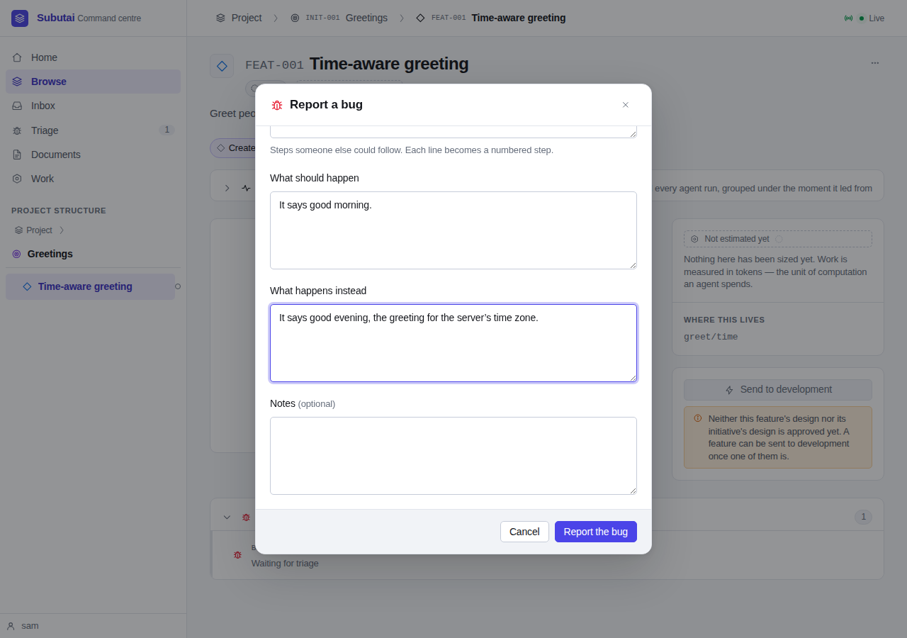

Reporting it opens the new bug's page. It is `BUG-002`, with the bug icon, and
its report is the page's body: the steps became a numbered list, and the
acceptance criterion "The defect no longer reproduces" is already there. The
triage card says who reported it, where, and that nothing runs until a person
decides. There is no Send button yet.

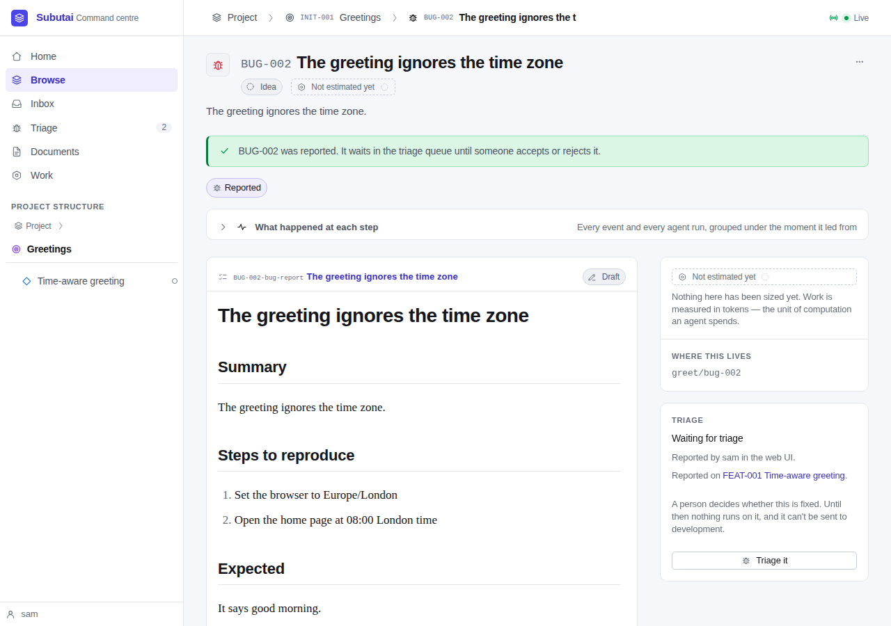

## 3. The triage queue, and its counts

**Triage** in the navigation has its own count, 2. The queue lists both bugs,
oldest first, each saying who reported it and how, where it was found, and
what its report says. Each offers the three decisions, each saying what it
will do.

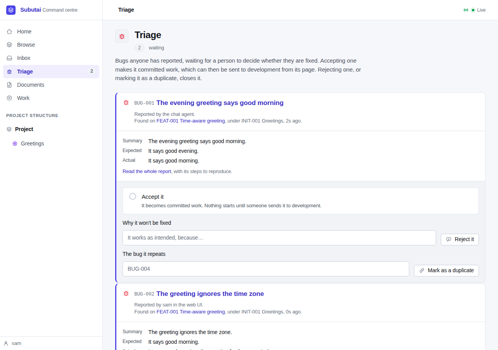

The Inbox says so too, above its questions. (Its own badge counts one
question: the spending limit this demo spent on purpose.)

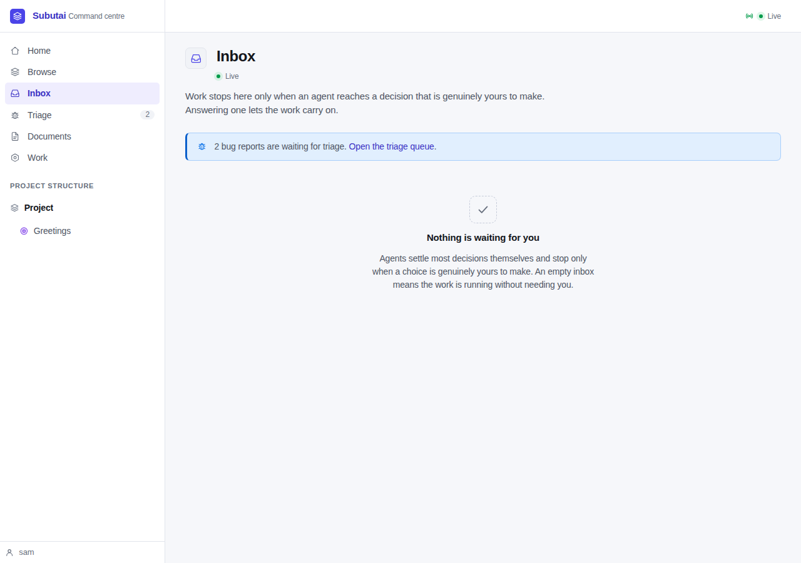

## 4. Accepting, and a relayed rejection

The person accepts `BUG-002` in the queue.

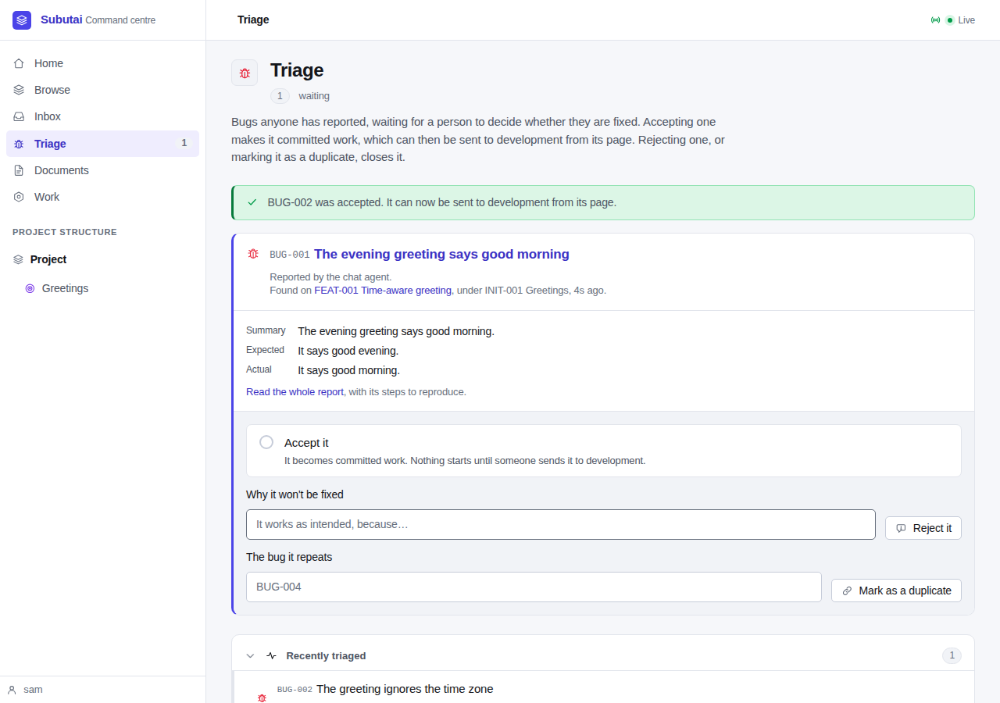

The person tells the chat agent to reject the other one, and it relays the
decision with their words:

```
» relay_triage {"bug":"BUG-001","decision":"reject","reason":"It is the same fault as the time-zone bug, seen from the other side.",
                "quote":"Reject the evening one, it is just the time-zone bug again."}
  {"id":"BUG-001","relayed":"recorded the person's triage decision: rejected","state":"abandoned","triage":"rejected", …}
```

The queue is empty now, and **Recently triaged** shows both decisions: the
relayed one as a person's, relayed by the chat agent, with their words.

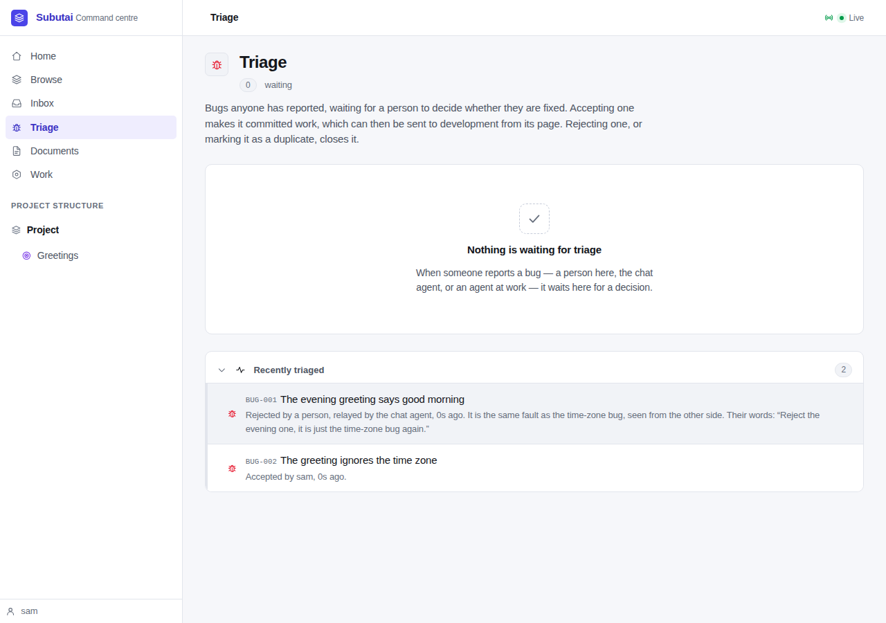

The rejected bug's page says the same, and it can't be sent.

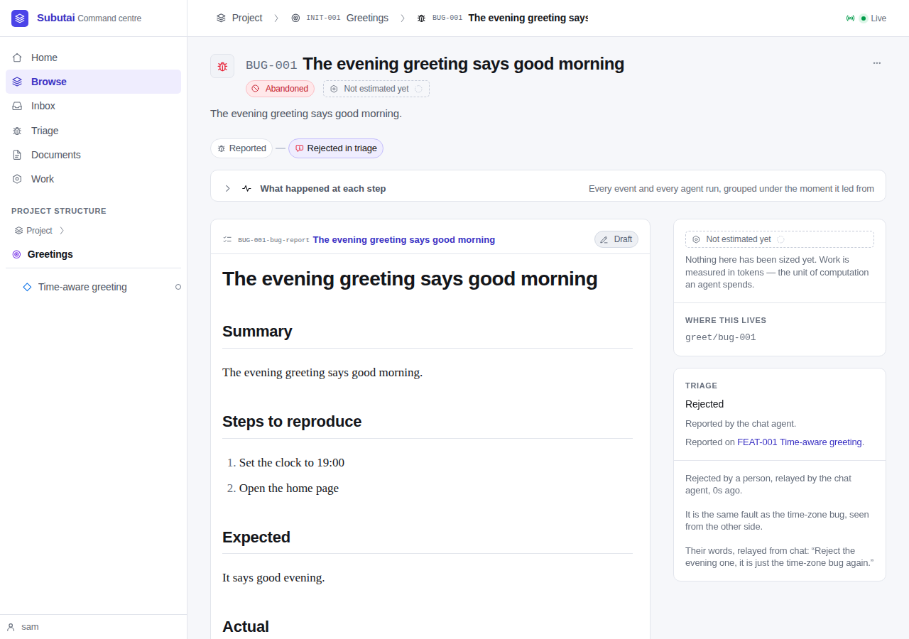

## 5. Sending the accepted bug

The accepted bug's page now has **Send to development**.

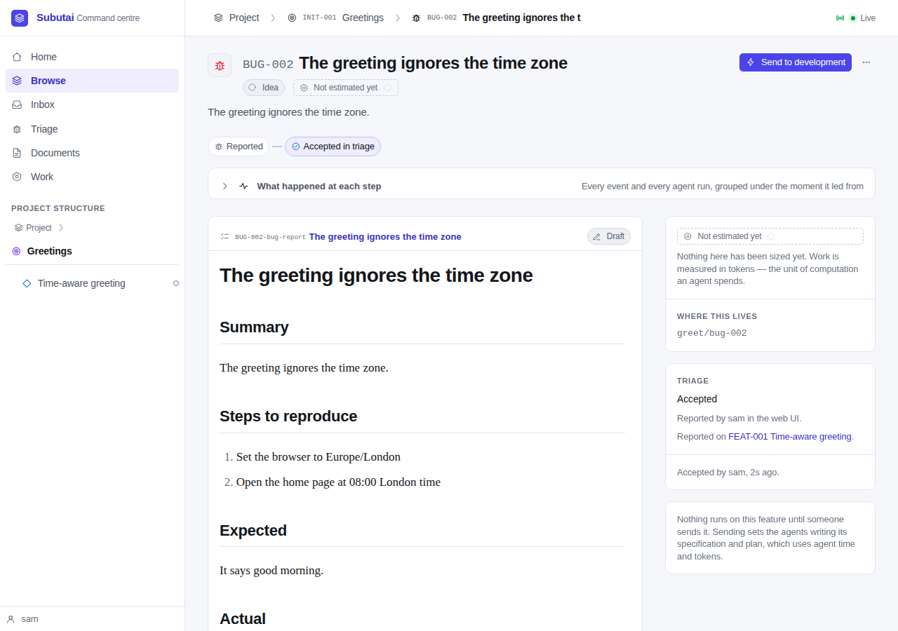

The send screen says the bug's report is its specification, so writing one is
skipped, and that the spec reviewer reviews the report as a specification.
The rest is a feature's: the plan, its review, the estimate.

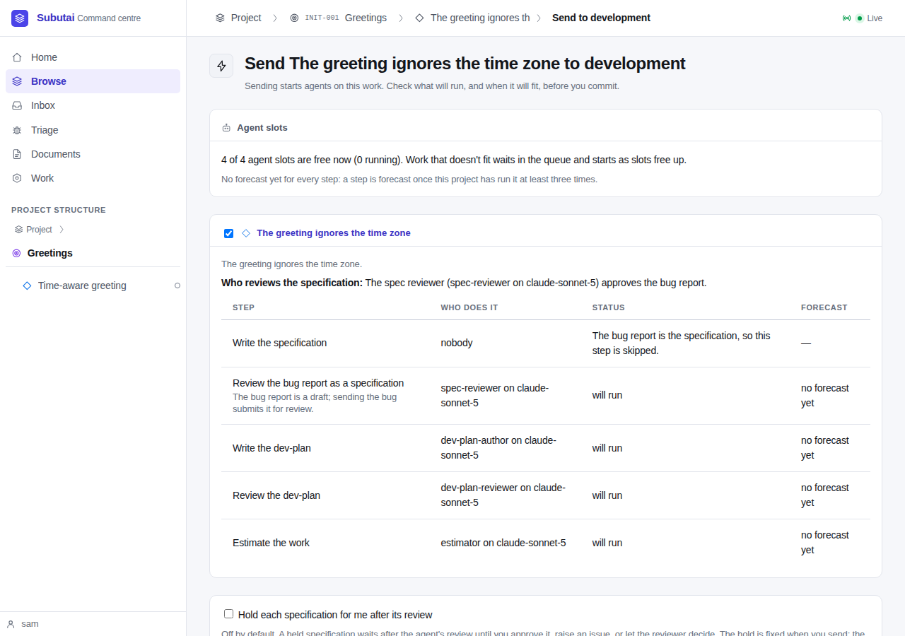

Sending it submits the report for review. The timeline reads *Reported ·
Accepted in triage · Sent to development*, then the spending-limit question
this demo set up. The report is in review, and Withdraw is still offered,
because its review is waiting in the queue.

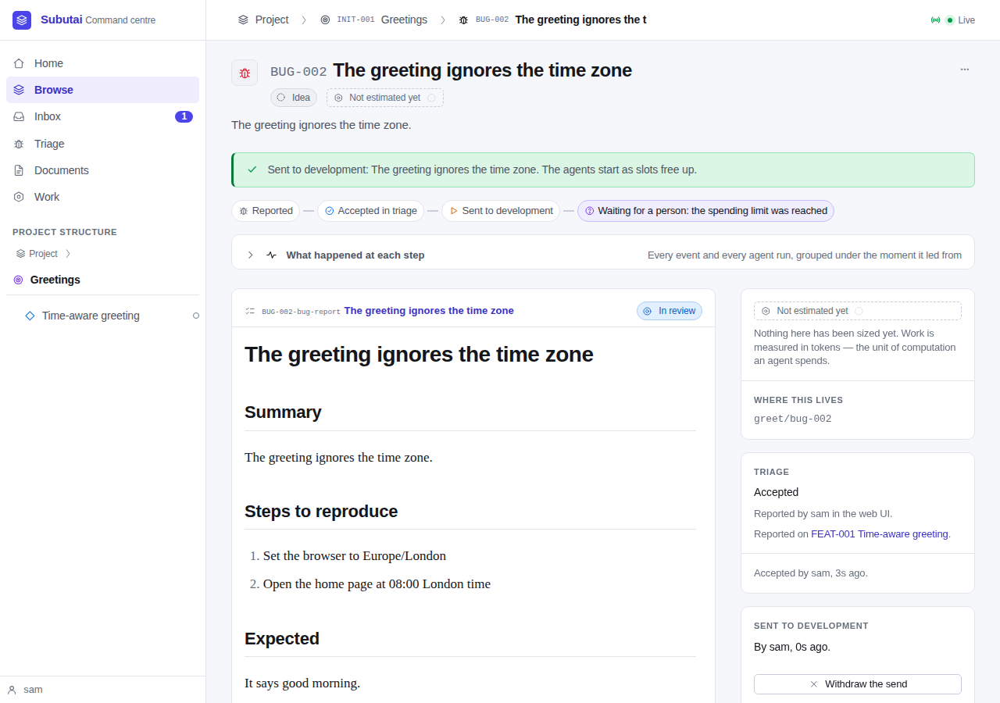

The report's own page shows it in review, with its agent review queued, and
the acts a person has on any spec: approve it, send it back, raise an issue.

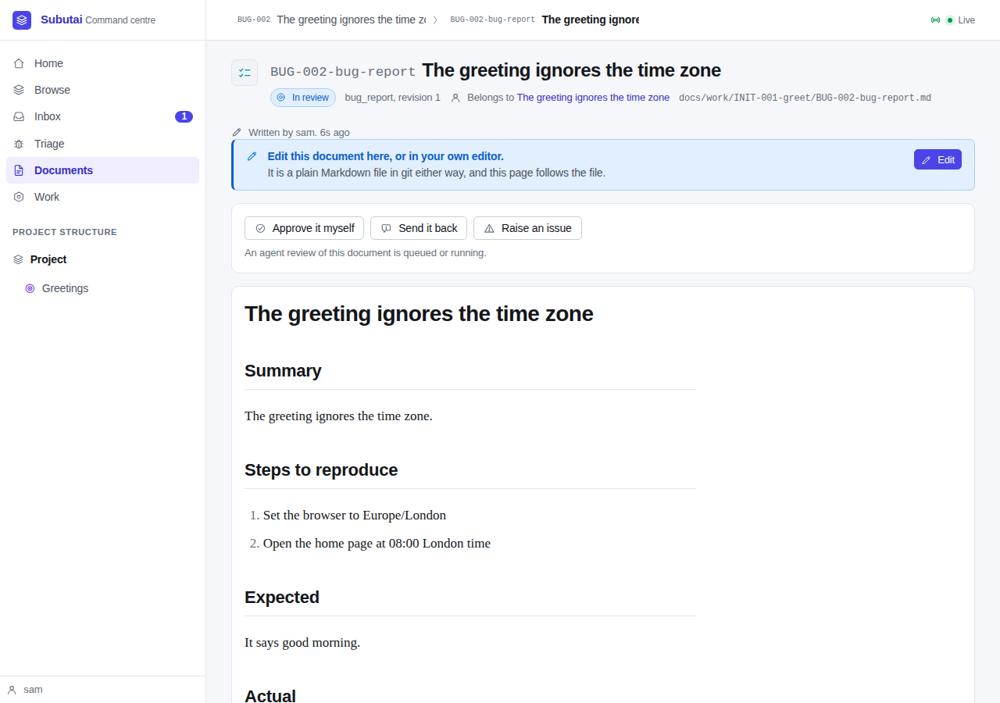

## What the walkthrough found

- **The address after a triage decision** was the form's, `/ui/bugs/triage`,
  so reloading the page failed. It now pushes `/ui/triage`.
- **The Accept answer ran its label into its consequence**, and the reject and
  duplicate fields sat above their buttons. The queue's answers now use the
  Inbox's answer markup, and each field shares a row with its button.
- **The send screen named the spec author** for the step a bug skips. It now
  says nobody.
