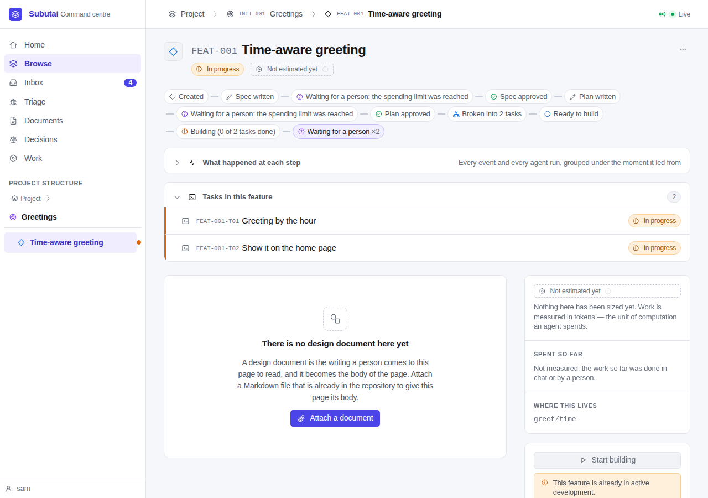
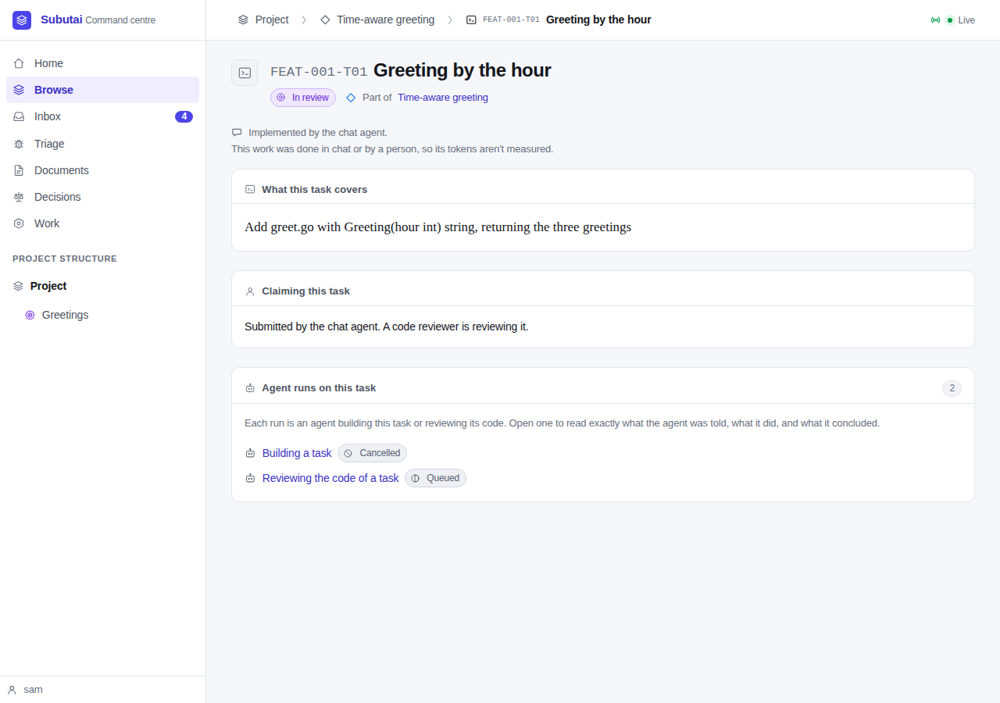
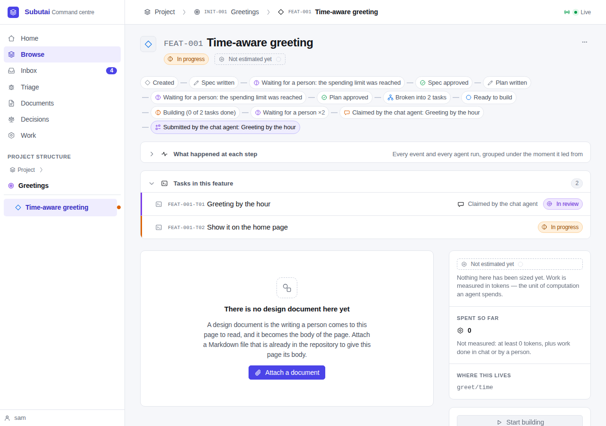
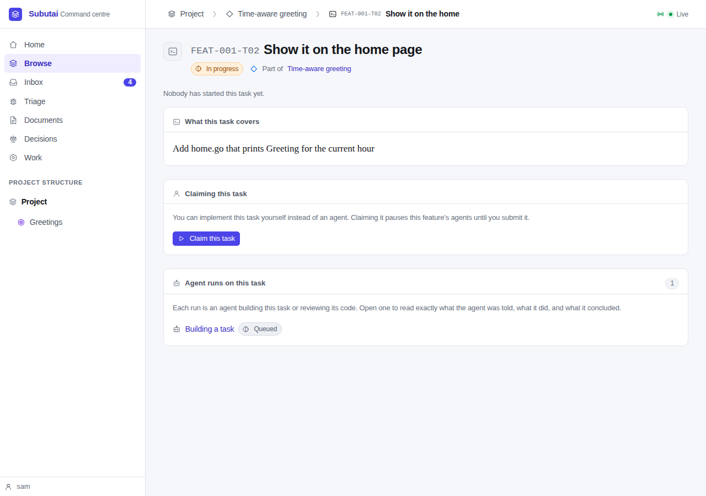
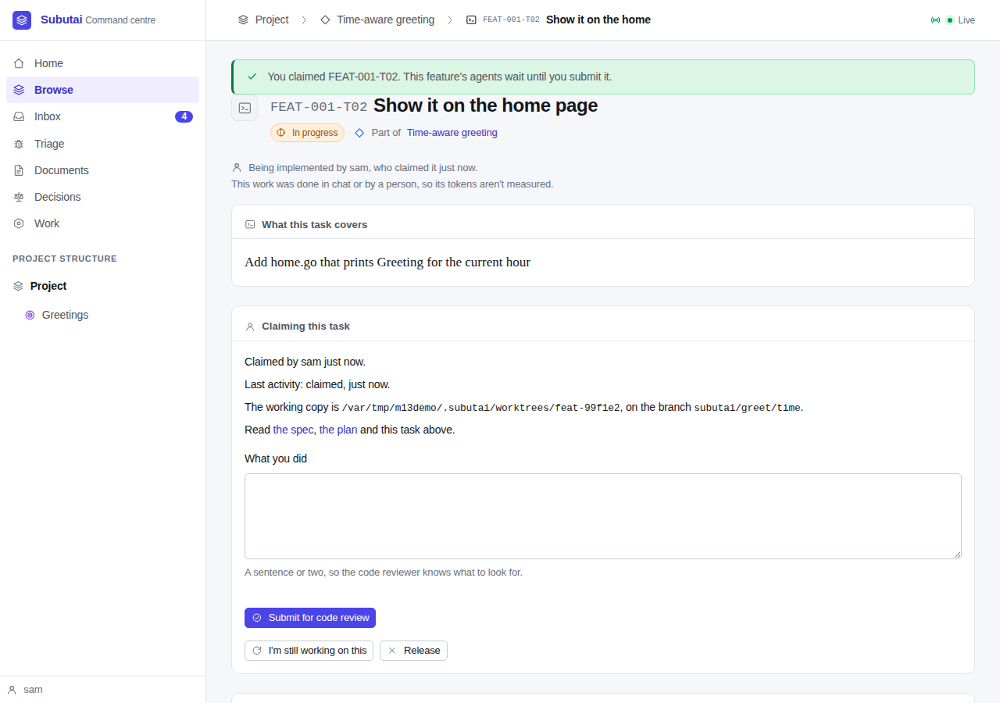
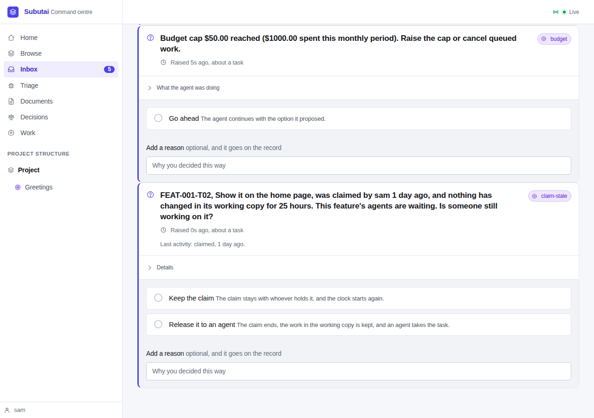
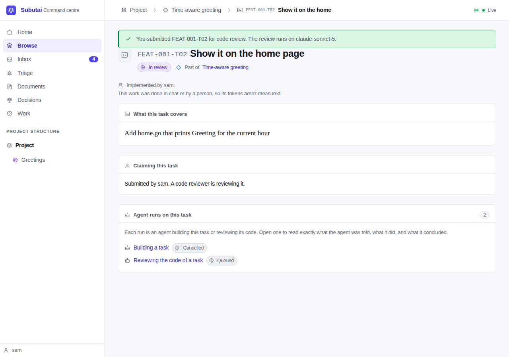
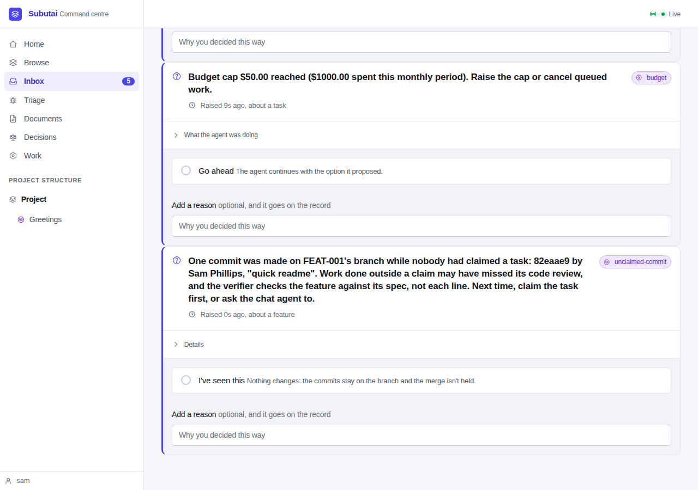
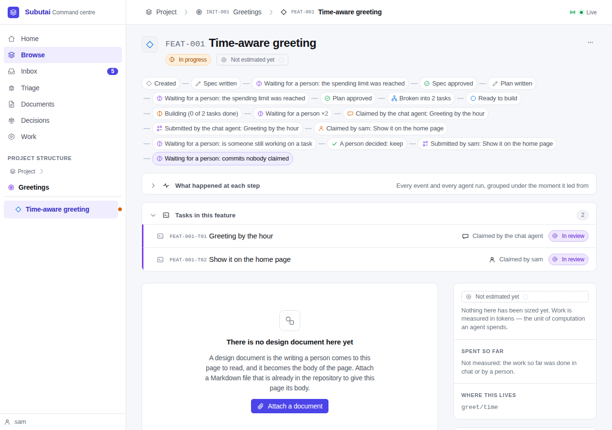

# Walkthrough — SPEC-020, executors

**Date:** 2026-10-02
**Spec:** [SPEC-020](specs/SPEC-020-executors.md), draft for Sam's approval
**Review:** [REVIEW-020](reviews/REVIEW-020-executors.md)
**Handoff:** [M13 handoff](notes/handoff-M13-2026-10-02.md)

This is the definition-of-done demo (SPEC-020 DoD 3). It ran a throwaway
project against a real Postgres, **with no AI provider**.
- The project lived at `/var/tmp/m13demo`, a short path, because a Unix
  socket path can't be longer than 108 bytes.
- The chat agent's side ran as plain MCP JSON-RPC calls, which is what a chat
  AI sends.
- The person's side ran in the browser, with Playwright and the
  pre-installed Chromium.

The scripts are in [walkthrough-spec-020/](walkthrough-spec-020/):

- **`setup.sh`** does the following:
  - builds `./cmd/subutai` and makes the project with `subutai init`;
  - plans a feature, *Time-aware greeting* (`FEAT-001`), with a spec and a
    plan of two independent tasks;
  - submits both, and has a person approve each one directly;
  - serves the project on `127.0.0.1:8820`.

  The provider key is a dummy, and the project's spending limit is spent
  before the server starts. So dispatched work waits in the queue, where it
  can be seen, instead of calling a model.
- **`walk.js`** plays the person in the browser, and makes the chat agent's
  calls over MCP. The chat agent's calls and answers are logged to
  [chat-output.txt](walkthrough-spec-020/chat-output.txt).

```sh
bash docs/walkthrough-spec-020/setup.sh
node docs/walkthrough-spec-020/walk.js docs/walkthrough-spec-020
```

**What needs a model, and where it is proved instead.** Without a provider,
no code reviewer reviews, no implementer implements, and no verifier
verifies. Those steps are proved with the mock provider against real
Postgres by `TestChatClaimedTaskIsReviewedAndVerifiedLikeAnAgents`
(`internal/server/integration_executors_e2e_test.go`). It is the roadmap's
done-when as one test:

1. A feature with an estimate and two independent tasks is started.
2. The chat agent claims T01 over MCP. T01's queued implement dispatch is
   cancelled, and T02's dispatch waits behind the claim, with its reason.
3. The chat agent writes a file and submits.
4. The code reviewer asks for changes. The claim is `returned`, and no
   implementer is queued for T01. `get_feature` shows the comments, and
   `claim_task` resumes the claim with them.
5. The chat agent submits again. The reviewer approves with the chat reviewer
   model, the priciest configured model. T02's review uses the usual model.
6. The verifier runs and approves, and the feature merges.
7. The task page, `get_feature` and the timeline say T01 was implemented by
   the chat agent and T02 by the implementer. T01, the feature and the
   initiative are unmeasured, and the feature is left out of the calibration
   corpus, which still includes a measured feature.

The test ends by checking that no claimed task was ever approved without a
succeeded code review or a person's answer (FR-6.4).

## 1. Start building, and the tasks

A person presses **Start building**. Each task's implement dispatch waits in
the queue, because the budget is spent. The feature page has a new section,
**Tasks in this feature**.



## 2. The chat agent claims a task, works it, and submits

The chat agent reads `get_feature`. Each task has `claimable`, and an
executor sentence: "Nobody has started this task yet." It claims T01. The
result carries the working copy's absolute path and branch, the contract
(the spec, the plan, the task and any surfaced decisions), the rules, and the
expiry.

```
» claim_task {"task":"FEAT-001-T01"}
  { "working_copy": { "branch": "subutai/greet/time",
                      "path": "/var/tmp/m13demo/.subutai/worktrees/feat-99f1e2", … },
    "rules": [ "Edit files only inside the working copy named in this result.",
               "Don't commit: Subutai commits your work when you submit it.", … ],
    "expires": "If nothing changes in the working copy for 24 hours, the person
                will be asked whether anyone is still working on this." }
» claim_task {"task":"FEAT-001-T02"}
  refused: FEAT-001-T01 is claimed by the chat agent, in this feature's working
  copy. Only one task in a feature can be worked at a time; wait for it to be
  submitted.
```

The claim cancelled T01's queued implement dispatch. The chat agent wrote
`greet.go` in the working copy and submitted it. Subutai committed the work
with the executor's trailers and queued a dispatched code review. The review
model is the starter config's priciest model, `claude-sonnet-5`. Submitting
twice is refused.

```
» submit_task {"task":"FEAT-001-T01","summary":"Added Greeting(hour), …"}
  { "state": "review", "review": { "model": "claude-sonnet-5", "run_id": "…" },
    "next": "A code reviewer will review this. get_feature shows its state and
             any comments. If it comes back, call claim_task to resume it. You
             can't review or approve it yourself." }
```

The task's page says who did it. It also says the tokens aren't measured, and
which model reviews it.



On the feature page, the task row shows the chat icon and "Claimed by the
chat agent". The timeline has "Claimed by the chat agent" and "Submitted by
the chat agent". The rail's *Spent so far* says "Not measured: the work so
far was done in chat or by a person."



## 3. A person claims a task in the web UI

T02's page offers the claim, and says what it costs: "Claiming it pauses this
feature's agents until you submit it."



Once T02 is claimed, the panel shows the following:
- who holds the claim, and since when;
- the last activity;
- the working copy's path and branch;
- links to the spec and the plan;
- the **Submit for code review** form;
- **I'm still working on this** and **Release**.



## 4. "Is someone still working on this?"

The walkthrough backdates the claim's last activity by 25 hours, so the
default expiry of 24 hours has passed. Within one heartbeat, the claim sweep
raises the question in the Inbox. It has two answers, **Keep the claim** and
**Release it to an agent**, and it shows the last activity. The chat agent
has no tool that answers it.



The person answers **Keep the claim**. Then they write `home.go` and submit
T02 from the page. The page redirects with the notice, and the panel reads
"Submitted by sam. A code reviewer is reviewing it."



## 5. A commit nobody claimed

With no claim open, someone commits a README on the feature's branch as Sam
Phillips. The post-commit hook (linked worktrees share it) starts the branch
watch at once. The watch raises a notice on the feature. It names the commit
and its author, and says the work may have missed its code review. Subutai's
own commits, from the two submissions, aren't flagged, because the watch
knows them by their hashes.



## 6. The timeline, and the boundary

The feature's timeline shows the claim moments. The tools that would let the
chat agent judge, release or implement as an agent don't exist:

```
» approve_task           error -32601: there is no tool called "approve_task" on this server
» release_task           error -32601: there is no tool called "release_task" on this server
» verify_feature         error -32601: there is no tool called "verify_feature" on this server
» submit_implementation  error -32601: there is no tool called "submit_implementation" on this server
```



## Fixes this walkthrough found

The first run worked end to end. Its screenshots showed three small defects,
which were fixed in the round-1 fixes before this run:
- *Spent so far* showed a bare "0" above the "Not measured" sentence;
- the claim panel's facts were a bulleted list hanging outside the panel;
- the Inbox labelled a claim's or a commit's details "What the agent was
  doing".
